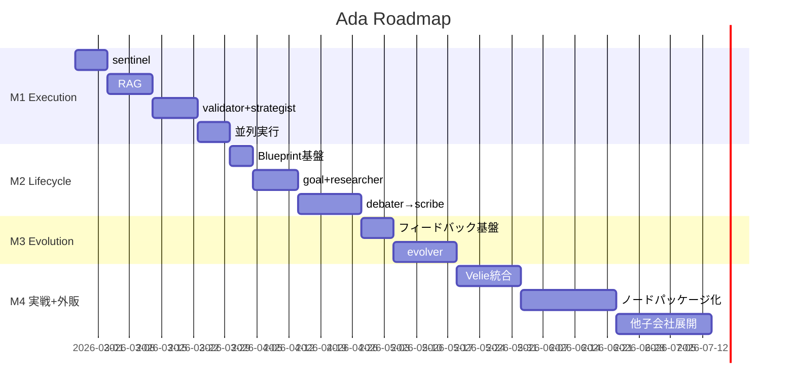

# Ada Roadmap — ロードマップ・マイルストーン・タスク

> WHITEPAPER.mdの戦略をタスクレベルに落とし込んだ実行計画。
> 各マイルストーンの完了条件と依存関係を明確にする。

---

## M1: Execution Layer 基盤完成（戦闘力 15→60）

### MS1.1: 入力防衛 — sentinel（+10）
**完了条件**: 全リクエストがsentinelを通過し、Prompt Injectionを検出・ブロックできる

| # | タスク | 工数 | 依存 |
|---|-------|------|------|
| 1.1.0 | `agent/nodes/base.py` — **AdaNode基底クラス定義**（LangGraph抽象化レイヤー） | 中 | — |
| 1.1.1 | `agent/nodes/sentinel.py` — Prompt Injection検出ロジック（パターンマッチ + LLM判定） | 中 | 1.1.0 |
| 1.1.2 | `graph.py` にsentinelノードを追加（Execution Layerのエントリーポイント） | 小 | 1.1.1 |
| 1.1.3 | 有害コンテンツフィルタ（カテゴリ別ブロック） | 小 | 1.1.1 |
| 1.1.4 | Security横断基盤 — executorのサンドボックス実行環境 | 中 | 1.1.1 |
| 1.1.5 | テスト作成（test_sentinel.py） | 小 | 1.1.2 |
| 1.1.6 | 全テスト通過確認 | 小 | 1.1.5 |

---

### MS1.2: 知識検索 — RAGパイプライン（+10）
**完了条件**: context_loaderがテナント別のドキュメントからRAG検索して結果を注入できる

| # | タスク | 工数 | 依存 |
|---|-------|------|------|
| 1.2.1 | `agent/rag/embeddings.py` — OpenAI/Anthropic Embeddings生成 | 中 | — |
| 1.2.2 | `agent/rag/retriever.py` — pgvector類似度検索 | 中 | 1.2.1 |
| 1.2.3 | `agent/rag/ingest.py` — ドキュメント登録API（チャンキング + 埋め込み） | 中 | 1.2.1 |
| 1.2.4 | Supabaseマイグレーション — `ada_documents`テーブル + RLS | 小 | — |
| 1.2.5 | `context_loader`ノードにRAG検索統合 | 中 | 1.2.2, 1.2.4 |
| 1.2.6 | テスト作成（test_rag.py） | 小 | 1.2.5 |
| 1.2.7 | 全テスト通過確認 | 小 | 1.2.6 |

---

### MS1.3: 出力品質保証 — validator + strategist強化（+10）
**完了条件**: validatorが幻覚を検出し、strategistが入力に応じてモデル・温度・CoTを動的に選択できる

| # | タスク | 工数 | 依存 |
|---|-------|------|------|
| 1.3.1 | `agent/nodes/validator.py` — Grounding検証（出力がソースに基づいているか） | 中 | MS1.2 |
| 1.3.2 | validator — フォーマット検証 + トーン一貫性チェック | 小 | 1.3.1 |
| 1.3.3 | `graph.py` にvalidatorノードを追加（conditional edge: 品質NG→executor再実行） | 中 | 1.3.1 |
| 1.3.4 | `strategist`強化 — 入力複雑度分析 + CoT制御 + Priority Weights適用 | 中 | — |
| 1.3.5 | 品質ティア実装 — Light/Standard/Fullの動的切替 | 小 | 1.3.3, 1.3.4 |
| 1.3.6 | テスト作成（test_validator.py, test_strategist.py） | 小 | 1.3.5 |
| 1.3.7 | 全テスト通過確認 | 小 | 1.3.6 |

---

### MS1.4: 並列実行 + Observability（+10）
**完了条件**: 並列Fan-out/Fan-inが動作し、全ノード実行がメトリクスとして計測・記録される

| # | タスク | 工数 | 依存 |
|---|-------|------|------|
| 1.4.1 | `agent/nodes/aggregator.py` — 重み付き結果統合 + 矛盾検出 | 中 | — |
| 1.4.2 | `graph.py` にFan-out/Fan-inパターン実装（LangGraph Send() API） | 大 | 1.4.1, MS1.3 |
| 1.4.3 | AgentBlueprintの`parallel_executors`設定からFan-outを動的構築 | 中 | 1.4.2 |
| 1.4.4 | `agent/observability.py` — ノード実行計測（実行時間・トークン数・コスト） | 中 | — |
| 1.4.5 | ノード実行単位のリソース管理（テナント間資源分離） | 中 | 1.4.4 |
| 1.4.6 | テスト作成（test_parallel.py, test_observability.py） | 中 | 1.4.3, 1.4.5 |
| 1.4.7 | 全テスト通過確認 | 小 | 1.4.6 |

---

## M2: Lifecycle Layer（戦闘力 55→70）

### MS2.1: AgentBlueprint基盤
**完了条件**: scribeがAgentBlueprintをSupabaseに永続化し、Execution Layerに自動注入できる

| # | タスク | 工数 | 依存 |
|---|-------|------|------|
| 2.1.1 | `agent/lifecycle/blueprint.py` — AgentBlueprintスキーマ（Pydantic） | 小 | — |
| 2.1.2 | Supabaseマイグレーション — `ada_blueprints`テーブル + RLS + バージョニング | 小 | 2.1.1 |
| 2.1.3 | Blueprint → RunnableConfig自動注入パイプライン | 中 | 2.1.2, M1完了 |
| 2.1.4 | テスト作成 | 小 | 2.1.3 |

---

### MS2.2: goal_intake + researcher
**完了条件**: ゴールを構造化し、並列リサーチで関連知識を収集できる

| # | タスク | 工数 | 依存 |
|---|-------|------|------|
| 2.2.1 | `agent/lifecycle/goal_intake.py` — 要件構造化 + 不明点検出 + Human-in-the-loop | 中 | — |
| 2.2.2 | `agent/lifecycle/researcher.py` — Web検索Tool + RAG + 信頼性スコア | 大 | MS1.2 |
| 2.2.3 | researcherの並列実行（Send() API） | 中 | 2.2.2, MS1.4 |
| 2.2.4 | テスト作成 | 小 | 2.2.3 |

---

### MS2.3: debater + architect + scribe
**完了条件**: 自動ペルソナ選出→ディベート→重み付け設計→Blueprint永続化の全フローが動く

| # | タスク | 工数 | 依存 |
|---|-------|------|------|
| 2.3.1 | `agent/lifecycle/debater.py` — ペルソナ自動選出 + 多ラウンドディベート | 大 | 2.2.1 |
| 2.3.2 | `agent/lifecycle/architect.py` — Priority Weights適用 + ツール/MCP選定 | 中 | 2.3.1 |
| 2.3.3 | `agent/lifecycle/scribe.py` — AgentBlueprint生成 + Supabase永続化 | 中 | 2.3.2, MS2.1 |
| 2.3.4 | Lifecycle Graph全体の組み立て + テスト | 大 | 2.3.3 |

---

## M3: Evolution Layer + フィードバック基盤（戦闘力 70→80）

### MS3.1: フィードバック収集基盤
**完了条件**: 明示的/暗黙的/品質メトリクスの3種フィードバックが収集・蓄積される

| # | タスク | 工数 | 依存 |
|---|-------|------|------|
| 3.1.1 | `server/feedback.py` — 評価エンドポイント（👍/👎 + コメント選択肢 + 自由記述） | 小 | — |
| 3.1.2 | Supabaseマイグレーション — `ada_feedback`テーブル | 小 | — |
| 3.1.3 | `agent/evolution/tester.py` — 暗黙的シグナル自動計測 | 中 | 3.1.2 |
| 3.1.4 | validator → 品質メトリクス自動記録パイプライン | 中 | MS1.3, 3.1.2 |
| 3.1.5 | テスト作成 | 小 | 3.1.4 |

---

### MS3.2: evolver（統計的最適化）
**完了条件**: 蓄積されたフィードバックからstrategistのモデル選択とRAGパラメータを自動調整できる

| # | タスク | 工数 | 依存 |
|---|-------|------|------|
| 3.2.1 | `agent/evolution/evolver.py` — 成功率ベースのパラメータ調整ロジック | 大 | MS3.1 |
| 3.2.2 | strategistモデル選択テーブルの自動更新 | 中 | 3.2.1 |
| 3.2.3 | context_loader RAG閾値の自動最適化 | 中 | 3.2.1 |
| 3.2.4 | evolverのバッチ実行スケジューラ（日次/週次） | 中 | 3.2.1 |
| 3.2.5 | テスト作成 | 小 | 3.2.4 |

---

## M4: 内販実戦 + 外販準備（戦闘力 80→90）

### MS4.1: Velie統合（最初の実戦検証）
| # | タスク | 工数 | 依存 |
|---|-------|------|------|
| 4.1.1 | VelieからAdaへのTool登録（github_diff, test_runner） | 中 | M1完了 |
| 4.1.2 | VelieのAgentBlueprintをLifecycleで設計 | 大 | M2完了 |
| 4.1.3 | 本番運用 + フィードバック収集 | — | 4.1.2, M3完了 |
| 4.1.4 | evolverによるパラメータ自動調整の検証 | 中 | 4.1.3 |

---

### MS4.2: 検証済みノードのパッケージング
| # | タスク | 工数 | 依存 |
|---|-------|------|------|
| 4.2.1 | 「世界最高のコードレビュアー」ノードセットの抽出・汎用化 | 大 | MS4.1 |
| 4.2.2 | 外販用ドキュメント + SDK + API仕様 | 大 | 4.2.1 |
| 4.2.3 | Usage課金基盤（ノード実行単位の計測・請求） | 大 | 4.2.1 |
| 4.2.4 | ランディングページ + 開発者ポータル | 中 | 4.2.2 |

---

### MS4.3: 他子会社展開
| # | タスク | 工数 | 依存 |
|---|-------|------|------|
| 4.3.1 | Cyrus統合 → 「グロースハッカー」ノードセット検証 | 大 | M2, M3 |
| 4.3.2 | Lumina統合 → 「クリエイティブディレクター」ノードセット検証 | 大 | M2, M3 |
| 4.3.3 | 各子会社の検証済みノードを外販カタログに追加 | 中 | 4.3.1, 4.3.2 |

---

## タイムライン

```
M1 (〜4週間): Execution Layer完成 ── sentinel + RAG + validator + strategist + 並列実行
M2 (〜4週間): Lifecycle Layer ── Blueprint + goal_intake → scribe
M3 (〜4週間): Evolution Layer ── フィードバック + evolver
M4 (〜8週間): 実戦検証 + 外販 ── Velie統合 → ノード販売開始
```



---

> **WHITEPAPER参照**: 全タスクの設計判断は`WHITEPAPER.md`に基づくこと
> **戦闘力目標**: 15/100 → M1完了: 60 → M2完了: 70 → M3完了: 80 → M4完了: 90
