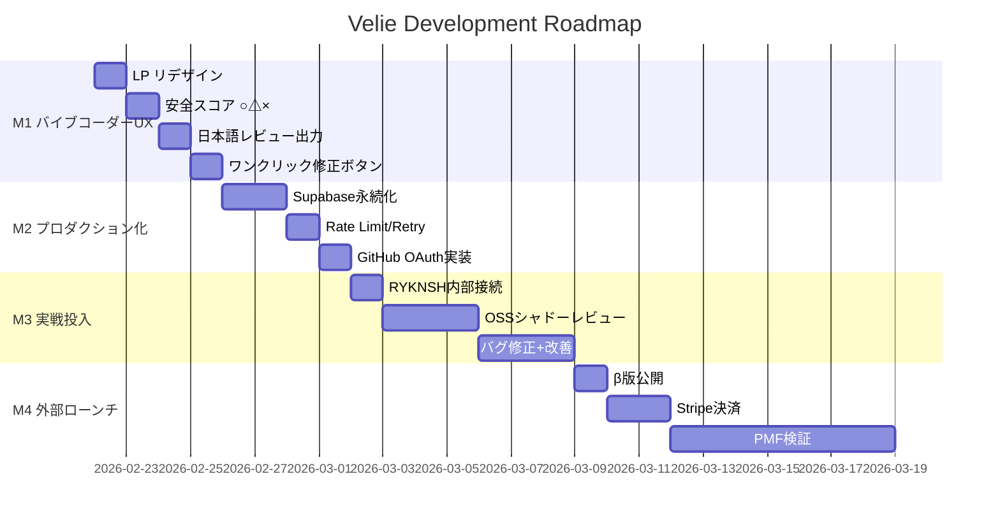

# Velie — 開発ロードマップ v1.0

> ホワイトペーパーの実現に向けた開発計画

---

## 全体タイムライン

---

## M1: バイブコーダーUX (4日)

**ゴール**: バイブコーダーが「これ使いたい」と思うUI/UXを作る

### M1-1: LP リデザイン
- [ ] ヒーロー: 「コードの安全は、Velieに任せて。」
- [ ] Features: 非エンジニア向けコピー（「ハッキングを自動で防ぐ」等）
- [ ] How it works: 3ステップ（繋ぐ→待つ→安心する）
- [ ] Pricing: ¥建て（無料/¥980/¥2,980/¥9,800）
- [ ] CTA: 「今すぐ無料で始める」

### M1-2: 安全スコア ○△×
- [ ] `severity` → 安全スコアへの変換ロジック
  - critical → × 危険（赤）
  - warning → △ 注意（黄）
  - clean → ○ 安全（緑）
- [ ] ダッシュボードのStatCardを安全スコア表示に変更
- [ ] ReviewItemの表示を○△×に変更
- [ ] Review Detailの表示を日本語の平易な説明に

### M1-3: 日本語レビュー出力
- [ ] `prompts.py` SYSTEM_PROMPTに日本語出力モード追加
- [ ] テナント設定の`review_language`をプロンプトに反映
- [ ] レビュー出力を非エンジニア向けの平易な日本語に
  - 例: 「SQLインジェクションの脆弱性」→「入力データがそのままデータベースの命令として実行される可能性があります。攻撃者がデータを盗んだり消したりできます。」

### M1-4: ワンクリック修正ボタン
- [ ] ダッシュボードのReview Detailに「🔧 修正する」ボタン追加
- [ ] ボタン押下 → `/api/autofix` POST → Fix PR自動作成
- [ ] Fix PR作成後にダッシュボードにステータス表示
- [ ] GitHub PR URLへのリンク表示

---

## M2: プロダクション化 (4日)

**ゴール**: 実運用に耐えるバックエンドに仕上げる

### M2-1: Supabase永続化
- [ ] `usage.py` → Supabase移行
- [ ] `feedback.py` → Supabase移行
- [ ] `health.py` → Supabase移行
- [ ] `trust.py` → Supabase移行
- [ ] `repo_learner.py` memory → Supabase移行
- [ ] `settings` API → Supabase移行
- [ ] テスト全更新

### M2-2: Rate Limit + Retry
- [ ] GitHub API: exponential backoff
- [ ] Claude API: rate limit queue + retry
- [ ] Circuit breaker パターン実装
- [ ] エラー通知（Slack or メール）

### M2-3: GitHub OAuth実装
- [ ] Login page: デモモード → 本物のOAuthフロー
- [ ] セッション管理（JWT + cookie）
- [ ] ダッシュボード認証ガード
- [ ] テナントとGitHubユーザーの紐付け

---

## M3: 実戦投入 (7日)

**ゴール**: 実PRで動かしてフィードバックループを回す

### M3-1: RYKNSH内部接続
- [ ] Velieサーバーをデプロイ（Railway or Fly.io）
- [ ] RYKNSH recordsリポにGitHub App接続
- [ ] テストPR 3本で動作確認
- [ ] 壊れた箇所をIssueに起票

### M3-2: OSSシャドーレビュー
- [ ] `shadow_review.py` 新規 — マージ済みPRを取得→レビュー生成→人間レビューと比較
- [ ] 対象: langchain, fastapi, next.js (各50PR)
- [ ] 精度レポート生成

### M3-3: バグ修正 + 改善
- [ ] 実戦で見つかった問題の修正
- [ ] プロンプト調整（シャドーレビュー結果から）
- [ ] Repo Memoryの精度改善

---

## M4: 外部ローンチ (10日)

**ゴール**: 最初の外部ユーザーを獲得し、PMFを検証する

### M4-1: β版公開
- [ ] LP + ダッシュボード本番デプロイ
- [ ] onboarding 3ステップUI完成
- [ ] ドキュメント（日本語）

### M4-2: Stripe決済
- [ ] Stripe Checkout統合
- [ ] ¥980/¥2,980/¥9,800プラン設定
- [ ] Webhook → usage.py連携

### M4-3: PMF検証
- [ ] 最初の10ユーザー獲得
- [ ] レビュー👍/👎リアクション計測
- [ ] 修正承認率の追跡
- [ ] NPS調査

---

## 成功指標

| 指標 | M1完了時 | M3完了時 | M4完了時 |
|------|---------|---------|---------|
| レビュー数 | 0 | 50+ | 500+ |
| 修正承認率 | - | 60%+ | 75%+ |
| ユーザー数 | 1(RYKNSH) | 1 | 10+ |
| 安全スコア精度 | - | 測定開始 | 80%+ |
| MRR | ¥0 | ¥0 | ¥9,800+ |
