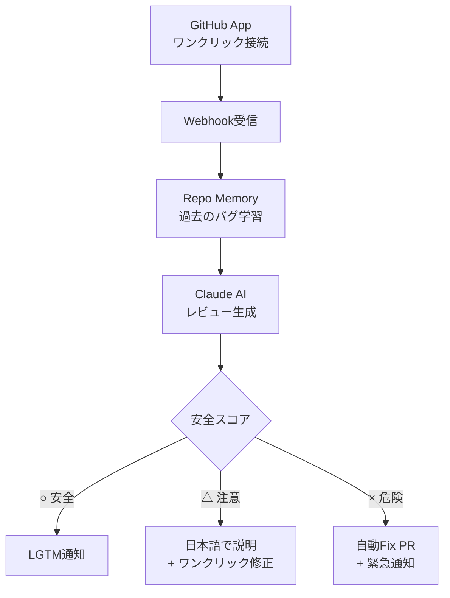

# Velie — ホワイトペーパー v1.0

> **「コードの安全は、Velieに任せて。」**

---

## 1. ビジョン

**コードを書く全ての人が、安心してプロダクトを世に出せる世界。**

エンジニアリングの訓練を受けていなくても、AIの力でコードを書ける時代が来た。しかし「書けること」と「安全であること」の間には巨大なギャップがある。Velieはそのギャップを埋める。

## 2. ミッション

GitHub Appをワンクリックでつなぐだけで、セキュリティ・バグ・品質の問題を自動で検出し、ボタン1つで修正する。**非エンジニアのための専属シニアQAエンジニア。**

## 3. 解いている問題

| 問題 | 従来の解決策 | Velieの解決策 |
|------|------------|--------------|
| セキュリティ脆弱性 | セキュリティエンジニアを雇う($150k/年) | **月額¥980で自動検出** |
| コードレビュー不在 | シニアエンジニアに依頼 | **AIが24時間即座にレビュー** |
| 「動くけど安全？」の不安 | 自分で学ぶ(数年かかる) | **安全スコア○△×で一目瞭然** |
| バグの見落とし | テストを書く(書き方がわからない) | **過去のバグパターンから自動検出** |
| 修正方法がわからない | Stack Overflow/ChatGPTで調べる | **ボタン1つで自動修正** |

## 4. ターゲット顧客

**バイブコーダー** — AIを使ってコードを書けるが、ソフトウェアエンジニアリングの訓練を受けていない人。

- Cursor / Copilot でアプリを作るデザイナー・起業家
- v0 / bolt.new でプロトタイプを立ち上げるビジネスパーソン
- プログラミング学習中の学生
- 社内ツールを自作するマーケター・PM

**推定市場規模**: Cursor月間アクティブユーザー数百万人。GitHub Copilot利用者1.5億人の半数以上がAI補助でコーディング。年間30%以上のペースで成長中。

## 5. ポジショニング

```
            エンジニア向け          非エンジニア向け
           ┌──────────────┐      ┌──────────────┐
  レビュー  │ CodeRabbit   │      │              │
           │ Sourcery     │      │   Velie      │
           ├──────────────┤      │   ★ ここ     │
  テスト    │ Qodo         │      │              │
           │ Codex        │      │              │
           └──────────────┘      └──────────────┘
            レッドオーシャン        ブルーオーシャン
```

## 6. プロダクト原則

1. **3ステップで完了** — 繋ぐ・待つ・安心する。それ以上の操作を求めない
2. **日本語で話す** — 技術用語を使わない。「SQLインジェクション」→「データベースが攻撃される可能性」
3. **安心を売る** — 機能を売らない。安全スコア○△×が全て
4. **ボタン1つで直る** — 問題を見つけるだけでなく、ワンクリックで修正PRを出す
5. **静かに守る** — 確信度の低い指摘はしない。ノイズ = 不信

## 7. 技術アーキテクチャ



## 8. プライシング

| プラン | 価格 | 対象 |
|--------|------|------|
| **無料** | ¥0/月 | 1リポ・月5レビュー |
| **安心プラン** | ¥980/月 | 3リポ・無制限レビュー |
| **プロ** | ¥2,980/月 | 10リポ・自動修正・優先サポート |
| **チーム** | ¥9,800/月 | 無制限・SSO・SLA |

## 9. 競合との違い

| | CodeRabbit | Qodo | **Velie** |
|---|-----------|------|-----------|
| 顧客 | エンジニアチーム | エンジニアチーム | **バイブコーダー** |
| 言語 | 英語 | 英語 | **日本語 + 英語** |
| 出力 | 技術的なレビュー | テスト生成 | **○△× + 平易な説明** |
| 修正 | なし | なし | **ワンクリック修正** |
| 学習 | ステートレス | ステートレス | **リポの歴史を記憶** |
| 価格 | $19/mo〜 | $19/mo〜 | **¥980/月〜** |

---

*RYKNSH records / 2026*
