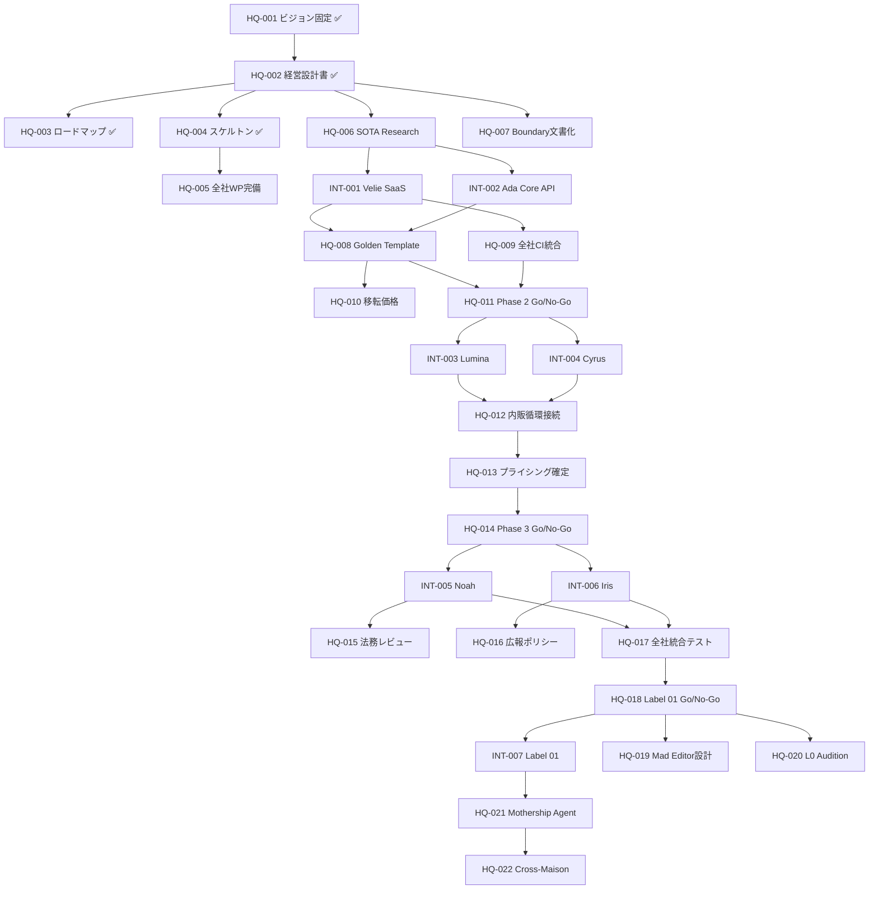

# RYKNSH records — MILESTONES
> **本社（Mothership）視点のマイルストーン定義**

**Version**: 1.0
**Last Updated**: 2026-02-23
**Perspective**: CEO / Holdings HQ

---

## マイルストーン体系

ロードマップの各Phaseを、**検証可能な完了条件（Done Criteria）** を持つマイルストーンに分解する。
本社固有のマイルストーン（HQ-）と、子会社横断の統合マイルストーン（INT-）を分離して管理する。

---

## Phase 0: Architecture Lock ✅

### HQ-001: ビジョン・戦略の完全固定 ✅
- **Done**: ディベート全19ラウンド完了 + 全員Consensus
- **成果物**: `holdings_blueprint.md`

### HQ-002: 経営設計書の確定 ✅
- **Done**: Strategy Bible / Architecture Blueprint / Master Execution Plan / Company Directory / WHITEPAPER 完成
- **成果物**: `docs/` 配下の5文書 + `WHITEPAPER.md`

### HQ-003: 本社ロードマップの策定 ✅
- **Done**: 本文書（MILESTONES.md）+ ROADMAP.md + TASKS.md 完成
- **成果物**: `ROADMAP.md`, `MILESTONES.md`, `TASKS.md`

---

## Phase 0.5: SOTA Research & Scaffolding 🔶

### HQ-004: Monorepoスケルトンの物理固定 ✅
- **Done**: 全7子会社の空ディレクトリ + .gitkeep + ルートREADME 存在
- **成果物**: `/Velie/`, `/Lumina/`, `/Cyrus/`, `/Iris/`, `/Ada/`, `/Noah/`, `/Label01/`, `/Holdings/`

### HQ-005: 全子会社ホワイトペーパーの完備
- **Done**: 7社すべてに `WHITEPAPER.md` が存在し、事業定義・プロダクト・アーキテクチャ・収益モデルが記載
- **現状**: Velie ✅ / Ada ✅ / Lumina ✅ / Cyrus ✅ / Iris ⬜ / Noah ⬜ / Label01 ⬜
- **残タスク**: Iris / Noah / Label01 のホワイトペーパー作成

### HQ-006: SOTA Research 完了
- **Done**: LangGraph最新機能 / Supabase RLS最適パターン / Next.js 15+ / MCP最新を調査し、Architecture Blueprint に反映
- **現状**: ⬜ 未着手

### HQ-007: Boundary Protocol のガバナンス文書化
- **Done**: 全子会社の開発者（AI含む）が参照すべき「境界管理ルールブック」が `/docs/` に存在
- **現状**: WHITEPAPER §12 に概要記載済み。独立文書は ⬜ 未作成

---

## Phase 1: The Core Foundation 🔶

### INT-001: Velie — 外販SaaS完成
- **Done**: Sprint 1-4 全完了。Stripe課金 + ダッシュボード + OSS公開
- **現状**: Sprint 1 Core Done（Sprint 2-4 残）
- **KPI**: MRR $10K / 有料顧客 50社 / ⭐500 Stars

### INT-002: Ada — Core API 外販完成
- **Done**: マルチプロバイダーLLMルーティング + テナント分離 + API公開 + OSS
- **現状**: Sprint 1 Core Done
- **KPI**: OSS Stars 1K+ / マネージド顧客 10社

### HQ-008: Golden Template の確立と承認
- **Done**: Velie で構築した SaaS共通基盤（Webhook → Queue → LangGraph → Supabase → Stripe → Next.js）を「Golden Template」として正式承認
- **検証**: Lumina/Cyrus への転用シミュレーション完了
- **現状**: ⬜ Velie Sprint 4 完了後に実施

### HQ-009: グループ全社 CI/CD 統合
- **Done**: 全7子会社のリポジトリに Velie CI が統合され、PRがVelie品質ゲートを通過しなければmerge不可
- **KPI**: グループ全社CI通過率 99%+
- **現状**: ⬜ Velie Sprint 2 以降

### HQ-010: 内販移転価格ルール初版
- **Done**: 各子会社間の内販利用料（QA利用料、AI利用料、アセット制作費等）の計算ロジックとSupabaseでの自動集計クエリが確定
- **現状**: ⬜ 未着手

### HQ-011: Phase 2 移行判断 (Go/No-Go)
- **Done**: INT-001, INT-002, HQ-008, HQ-009 が全て完了 → Phase 2 Go
- **判断基準**: Golden Template が無改造で Lumina/Cyrus に転用可能であること

---

## Phase 2: The Creative & Growth Engine ⬜

### INT-003: Lumina — AI Creative Studio 外販開始
- **Done**: Golden Template 転用 + 画像/動画生成パイプライン + MV Factory + 外販開始
- **前提**: HQ-008（Golden Template承認）

### INT-004: Cyrus — Growth Agent 外販開始
- **Done**: Golden Template 転用 + リード獲得自動化 + Campaign Engine + 外販開始
- **前提**: HQ-008 + INT-003（Lumina のアセットをCyrusが配信）

### HQ-012: 内販循環フローの接続
- **Done**: Lumina → Cyrus → Velie の内販データフローが稼働し、Lumina制作物をCyrusが配信しVelieが品質検証する循環が自動化
- **検証**: 1つの架空キャンペーンで End-to-End テスト完了

### HQ-013: 外販プライシング最終承認
- **Done**: 全4社（Velie/Ada/Lumina/Cyrus）の外販価格表が確定し、Stripe上のプランとして設定完了

### HQ-014: Phase 3 移行判断 (Go/No-Go)
- **Done**: INT-003, INT-004, HQ-012 完了 → Phase 3 Go

---

## Phase 3: The Community & Defense ⬜

### INT-005: Noah — Fan Platform MVP
- **Done**: コミュニティUI + 課金エンジン（サブスク/チップ）+ PF手数料自動徴収
- **前提**: HQ-013（Stripe統合パターン確立）

### INT-006: Iris — AI Press Agent + Crisis Shield
- **Done**: プレスリリース自動執筆 + メディア配信 + 24h炎上監視 + 対応ドラフト自動生成
- **前提**: INT-005（Noah上でブランドコミュニティ運用開始）

### HQ-015: Noah課金の法務レビュー
- **Done**: ファン向けサブスクリプションの利用規約 / 特商法表記 / 決済フロー の法務チェック完了

### HQ-016: グループ広報ポリシー策定
- **Done**: Irisが遵守すべきグループ統一の広報ガイドライン（メディア対応/危機管理/SNS運用）が文書化

### HQ-017: 全6社 内販フロー統合テスト
- **Done**: Velie → Ada → Lumina → Cyrus → Noah → Iris の全内販接点が稼働し、1つの架空IPで End-to-End シミュレーション完了
- **検証**: 架空IPが「Cyrusで集客→Noahでファン化→Luminaでアセット→Irisでプレス→Velieで品質」の循環を完了

### HQ-018: Label 01 開始判断 (Go/No-Go)
- **Done**: 全6社の外販稼働 + 内販循環テスト完了 → Label 01 Go

---

## Phase 4: The Final Show ⬜

### INT-007: Label 01 — 初代IP リリース
- **Done**: アーティスト選定 + Mad Editor Protocol 稼働 + Studio Stream で制作過程公開 + ファン課金開始
- **前提**: HQ-018（全社Go/No-Go通過）

### HQ-019: Mad Editor Agent パラメータ設計
- **Done**: Predictability Score閾値 / 制約生成アルゴリズム / インセンティブ設計（特権アンロック条件）が確定
- **倫理レビュー**: アーティストへの負荷が過度でないことの検証

### HQ-020: L0 オーディション層の設計と開放
- **Done**: 世界中のアーティストがデモ（PR）を投稿可能な L0 Audition Layer が稼働
- **仕組み**: 軽量共用AI がスクリーニング → 基準通過で L1 昇格

### HQ-021: Mothership Agent（L0 Orchestrator）実装
- **Done**: 全子会社Graph（L1）を統括するL0 Mothership Graphが稼働。イベントのルーティング・並列ディスパッチ・完了集約を自動化
- **前提**: L1 が3つ以上稼働してから構築（ボトムアップ・オーケストレーション）

### HQ-022: Cross-Maison Collaboration Engine
- **Done**: Mothership Agent が相性の良い（あるいは最悪の）IP同士を自動マッチングし、コラボリポジトリを強制生成する仕組み

---

## マイルストーン依存関係

---

## ステータス凡例

| 記号 | 意味 |
|------|------|
| ✅ | 完了 |
| 🔶 | 進行中 |
| ⬜ | 未着手 |

---

*See also: [ROADMAP.md](file:///Users/ryotarokonishi/Desktop/AntigravityWork/RYKNSH%20records/docs/ROADMAP.md) | [TASKS.md](file:///Users/ryotarokonishi/Desktop/AntigravityWork/RYKNSH%20records/docs/TASKS.md) | [WHITEPAPER.md](file:///Users/ryotarokonishi/Desktop/AntigravityWork/RYKNSH%20records/docs/WHITEPAPER.md)*
