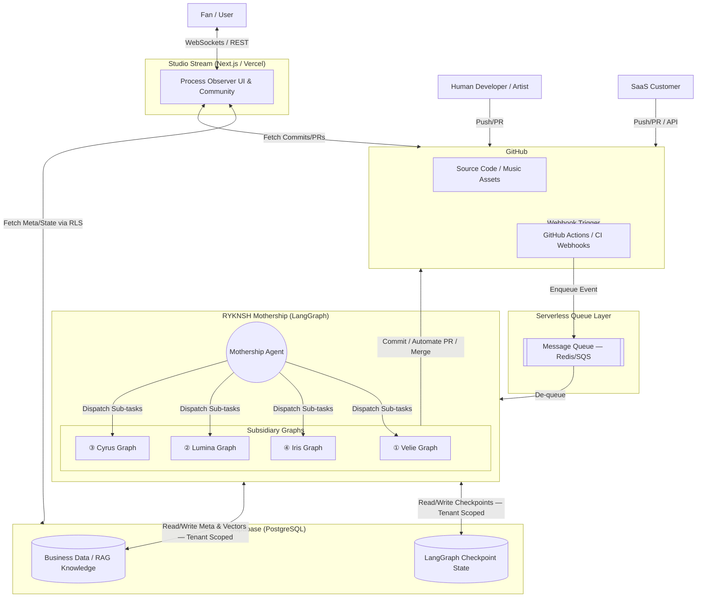

# RYKNSH records — WHITEPAPER
> **アーティスト以外全員AI。制作過程そのものを世界最強のエンターテインメントにするホールディングス。**

**Version**: 1.0
**Last Updated**: 2026-02-23
**Classification**: Internal — Executive Strategy Document

---

## Table of Contents

1. [Executive Summary](#1-executive-summary)
2. [Philosophy — WHY](#2-philosophy)
3. [Vision — WHERE](#3-vision)
4. [Mission — HOW](#4-mission)
5. [Strategy — WHAT](#5-strategy)
6. [The Mad Editor Protocol](#6-the-mad-editor-protocol)
7. [Holdings Architecture — 7子会社 + 本社](#7-holdings-architecture)
8. [System Architecture](#8-system-architecture)
9. [Revenue Strategy](#9-revenue-strategy)
10. [Go-to-Market Playbook](#10-go-to-market-playbook)
11. [Execution Roadmap — 3-Month Blitzkrieg](#11-execution-roadmap)
12. [Governance — The Boundary Protocol](#12-governance)
13. [Meta-Development Loop](#13-meta-development-loop)

---

## 1. Executive Summary

RYKNSH records（リュークンシュ・レコーズ）は、**「アーティスト以外全員AI」**という構想のもとに設計された次世代ホールディングスである。

音楽レーベルの「少年ジャンプ」を標榜し、LangGraph × GitHub × First Principles を基盤に、以下の3つの革新を同時に実現する：

1. **制作プロセスそのものをエンターテインメント化**（Open Process Economy）
2. **LVMH的ブランド・スウォーム戦略**で数百〜数千のIPを限界費用ゼロで並列運用
3. **7つの自律型AI子会社**が内販（自社利用）と外販（SaaS）の二刀流で収益を最大化

本ホワイトペーパーは、19ラウンドに及ぶ自律ディベート（Skeptic / Steve / Elon / Architect / Bernard / CFO / Visionary 参加）の全合意事項を統合した、RYKNSH records の経営設計書である。

---

## 2. Philosophy

> **「Gift & Receive — 与えることそのものが喜びの文化を創る」**

全ての事業・プロダクト・クリエイティブプロセスの根源にあるのは、「他者へ与え、それを受け取る」という喜びの循環である。テクノロジーやAIは、この循環を最大化し連鎖させるための手段にすぎない。

### 検証基準
あらゆる意思決定において問う：
- ❓ その仕組みは、参加者（ファン・アーティスト・開発者）に「与える喜び」を提供しているか？
- ❓ 単なる消費ではなく、Gift & Receive の循環（プロセスへの参加・還元）を生み出しているか？

---

## 3. Vision

> **「World Peace — 感動に満ちた平和な世界」**

国境・言語・人種の壁を超え、AIインフラを通じて世界中に圧倒的な「感動」を波及させる。誰もが自らの創造性を発揮し、他者の挑戦に熱狂し合える繋がりの連鎖が、最終的に「感動に満ちた平和な世界」を実現する。

天才たちの魂の軌跡をオープンソース化し、全人類の感情のポートフォリオを構築する。

### 到達指標（5年後）

| 指標 | 目標値 |
|------|--------|
| 同時並走する独立IP | 1,000+ |
| 月間アクティブ参加者 | 1億人 |
| 感情インフラとしての定着 | Global Standard |

---

## 4. Mission

> **「Power to the People — 人々に底なしの感動を与える」**

大衆の心を揺さぶり、底なしの感動を与え続けること。Mad Editor（狂気の壁）やOpen Process（制作過程の公開）といった極端なアプローチをシステムに組み込み、AIという最強の補助線を用いて人間の限界を突破させる。

### 3本柱

| 柱 | 概要 |
|----|------|
| **Mad Editor** | AIを「乗り越えるべき壁」として配置し、人間の限界を突破させる |
| **Open Process** | 制作過程を専用UI「Studio Stream」で全公開、ファンを参加者へ変える |
| **Zero Marginal Cost Scale** | AI限界費用ゼロ化で、あらゆる才能にプロデュース機会をスケール |

---

## 5. Strategy

> **「Unlock People Value — 人々の既に持っているはずの価値をアンロックする」**

ファン・アーティスト・開発者の内に眠る才能、熱狂、共感力を、エコシステムの力で解放（アンロック）する。

### 5.1 組織戦略 — ホールディングス構造
7子会社 + 本社による内販×外販の二刀流。（→ [§7 Holdings Architecture](#7-holdings-architecture)）

### 5.2 収益戦略 — 内販×外販マトリクス
全子会社がグループ内サービス提供（内販）で基盤を安定させつつ、外部へ専門SaaSを販売（外販）する。（→ [§9 Revenue Strategy](#9-revenue-strategy)）

### 5.3 顧客獲得戦略 — 4 Tierモデル
PLG / Content / AI Outbound / Halo Effect。人間の営業は0人。（→ [§10 Go-to-Market](#10-go-to-market-playbook)）

### 5.4 スケール戦略 — LVMH Swarm
各IPに目的関数を偏らせた専属AIチームを配置。カニバリゼーション防止のために多様性アルゴリズムで「人為的に設計されたエコシステム」を構築する。IP育成階層は L0（オーディション）→ L1（ルーキー）→ L2（メジャー/専属Graph）。Mothership Agentが相性の良い（あるいは最悪の）IP同士を強制マッチングし、Cross-Maison Collaborationを定期発生させる。

### 5.5 グローバル戦略
Day 1からグローバル。現地法人不要（全員AI）。GitHub = 世界共通プラットフォーム。法務のグローバル対応のみ本社のAI Legal Agent が処理。

---

## 6. The Mad Editor Protocol

RYKNSH records の核心的差別化要素。

### 概念

既存AIの目的関数は「即時的なLike」の最大化 → 凡作。
我々の Mad Editor Agent の目的関数は **「歴史的なパラダイムシフトの予測軌道（Predictive Trajectory of Cultural Impact）」** に基づく。

### メカニズム

```
1. アーティストが楽曲ステムを GitHub に Push
2. Mad Editor Agent がコードレビューのようにレビュー → Request Changes 発行
   （例：「Bメロを全部捨てろ」「ジャンルをパンクに変えろ」）
3. アーティストは対応してコミットを積む（= 努力の可視化）
4. ファンは Git History（コミットログ）を「連載漫画」のようにリアルタイム観測
5. ファンが PR を Approve しても、予測可能性スコアが高ければ Mad Editor が一蹴（Close）
```

### エンタメ構造

```
アーティスト & ファン  vs  狂気のAI編集者（Mad Editor）
        ↓                         ↓
   「人間の応援」            「理不尽だが芸術的な試練」
        ↓                         ↓
          → 新パラダイムの楽曲がドロップ → 世界が熱狂
```

Mad Editor は少年ジャンプにおける「最強のヴィラン」であり「最強の師匠」。この対立構造が、密室制作の既存レーベルには絶対に真似できないオープンなエンタメを生む。

### Predictability Score

ファンの PR Approve（人気投票）が「既存トレンドの延長」を推した時、AI編集者は「予測可能性スコアが90%超」と判定し、意図的にそれを破壊（Reject）。アーティストがこの試練を超えると、レーベル内特権（莫大なプロモ予算割当等）がアンロックされるインセンティブ設計。

---

## 7. Holdings Architecture

### 確定構造（7子会社 + 本社）

```
┌──────────────────────────────────────────────────────────────────┐
│                RYKNSH records (Holdings / Mothership)            │
│     ビジョン統括 / 法務・IP管理 / 経理 / 配信 / HR・スカウト(L0)    │
│              LangGraph Central Orchestrator                     │
├────────┬────────┬────────┬────────┬────────┬────────┬────────────┤
│①Velie  │②Lumina │③Cyrus  │④Iris   │⑤Ada    │⑥Noah   │⑦Label 01   │
│QA/検証  │Creative│Growth  │PR/Comms│AI R&D  │Community│Music Label │
├────────┼────────┼────────┼────────┼────────┼────────┼────────────┤
│コード   │デザイン  │分析    │PR      │LLM     │ファンUI │Mad Editor  │
│検証    │映像     │広告    │メディア │Fine-   │課金基盤 │A&R         │
│テスト   │コンテンツ│営業    │危機管理 │tune    │Issue/PR│ファン参加   │
│CI/CD   │教育     │イベント │ブランド │RAG     │ビューワ │IP育成      │
├────────┼────────┼────────┼────────┼────────┼────────┼────────────┤
│外販:   │外販:   │外販:   │外販:   │外販:   │外販:   │外販:       │
│QA SaaS │受託    │Growth  │PR代行  │AI基盤  │PF      │コンテンツ   │
│        │        │SaaS   │        │SaaS   │BtoB   │プラットフォーム│
└────────┴────────┴────────┴────────┴────────┴────────┴────────────┘
```

### 子会社プロフィール

| No | Code Name | 事業領域 | 外販プロダクト | 由来 |
|:---|:----------|:---------|:-------------|:-----|
| 0 | **RYKNSH records** | 本社・Orchestrator | — | Mothership |
| 1 | **Velie** (ヴェリー) | 品質保証 / QA | Velie CI | 真実（Verify/Verite）|
| 2 | **Lumina** (ルミナ) | AI制作プロダクション | Lumina Studio | 光。暗闘からアセットを生む |
| 3 | **Cyrus** (サイラス) | グロース / 営業 | Cyrus Growth | 太陽。市場を開拓する |
| 4 | **Iris** (アイリス) | 広報 / PR / 防衛 | Iris PR | 虹。ブランドを守る架け橋 |
| 5 | **Ada** (エイダ) | AI R&D / 基盤 | Ada Core API | Ada Lovelace。全社の頭脳 |
| 6 | **Noah** (ノア) | コミュニティ基盤 | Noah Platform | 箱舟。ファンの熱狂を乗せる |
| 7 | **Label 01** | 音楽レーベル | 音楽コンテンツ | 第1のレコードレーベル |

### 5つの設計原則

1. **内販×外販の二刀流** — 各社がグループ内サービス（内販）と外部SaaS（外販）を同時展開
2. **循環型エコシステム** — 制作→グロース→広報→レーベルと価値が循環
3. **Velieファースト** — Velieを通過しないコードは一行もデプロイされない
4. **LVMHアーキテクチャ** — バックエンド統合 / フロント分断
5. **Boundary Protocol** — 担当子会社のディレクトリから出ない・共有基盤を直接変えない・単体テスト境界を守る

### 本社機能（Mothership）に吸収される機能

| 機能 | 吸収先 | 理由 |
|------|--------|------|
| 法務 / IP管理 | 本社法務 | 知財が数千件を超えるまで独立不要 |
| 経理 / 配信インフラ | 本社基盤 | 外販できない非クリエイティブ機能 |
| HR / スカウト（L0オーディション） | 本社Orchestrator | IP配属はグループ全体戦略 |
| イベント / ライブ | ③Cyrus（グロース）部門 | 初期は独立P/L不可 |
| 教育 / アカデミー | ②Lumina（制作）部門 | クリエイティブ教育は制作の延長 |

---

## 8. System Architecture

### 設計思想 — 5つの柱

| 柱 | 概要 |
|----|------|
| **Multi-Graph Orchestration** | 各業務を独立したLangGraph Graphとしてモジュール化、Mothership Agentがオーケストレーション |
| **Two-Tier State Management** | AIのState（Checkpointer）とビジネスデータ（Metadata）をSupabase上で分離統合 |
| **Single Source of Truth** | 全プロセス・アセット・意思決定をGitHubに集約、トリガーとしてAIが自律稼働 |
| **True Multi-Tenancy** | 内販も外販も同一テナントとして処理。Supabase RLS + LangGraph Configで完全分離 |
| **Boundary Protocol** | 担当ディレクトリ外のコード修正・システム全体でのデバッグを固く禁止 |

### アーキテクチャ図



### Graph階層

| レイヤー | Graph種別 | 役割 |
|---------|----------|------|
| **L0 (Orchestrator)** | Mothership Graph | リクエストのルーティング。トップレベルイベントを受け取り、子会社Graphにサブタスクを並列ディスパッチ |
| **L1 (Company)** | Subsidiary Graph | 各子会社の業務プロセス（Velie QA, Lumina Creative等）。Webhookで自律起動 |
| **L2 (Agent)** | Node / Sub-Graph | 具体的な作業エージェント（コピーライターAI、テストエンジニアAI等）|

### Multi-Tenant 実装

```python
# 内販（RYKNSH本社）も外販（SaaS顧客）も全く同じコードパスを通る
config = {
    "configurable": {
        "tenant_id": "req.tenant_id",
        "llm_model": "tenant_settings.model_preference",
        "persona_prompt": "tenant_settings.custom_system_prompt",
        "thread_id": "unique_thread_for_this_pr"
    }
}
graphs["quality_assurance_ai"].invoke(inputs, config)
```

```sql
-- RLS：自分のテナントのデータしか絶対に見えない
ALTER TABLE review_requests ENABLE ROW LEVEL SECURITY;
CREATE POLICY "Tenants can view own requests" ON review_requests
  FOR SELECT USING (auth.jwt() ->> 'tenant_id' = tenant_id::text);
```

### スケーリング

```
GitHub Webhook → FastAPI Edge Server → Message Queue (Redis/SQS) → Worker Pool (LangGraph) → Supabase
```

- リクエストはQueueに積まれるだけ。システムが落ちることは決してない
- 数百台のWorker Containerが自動スケール
- 限界費用ゼロの無限スケール

### テクノロジースタック

| レイヤー | 技術 | 選定理由 |
|---------|------|----------|
| オーケストレーション | LangGraph | マルチエージェントState管理 / HITL対応 |
| LLM | Claude / GPT-4（マルチプロバイダー） | Ada（テックラボ）がルーティング最適化 |
| コード管理 | GitHub | SSOT。世界共通。Webhook連携 |
| CI/CD | GitHub Actions + Velie QA Agent | 全社品質ゲート |
| インフラ | Vercel / Cloudflare Workers | エッジ配信。グローバル低レイテンシ |
| DB | Supabase (PostgreSQL + pgvector) | RLS / Realtime / ベクトル検索 |
| 決済 | Stripe | グローバル対応。サブスク / 従量課金 |
| コミュニティ | Noah Platform + Discord | MVPまではDiscordで代替 |

---

## 9. Revenue Strategy

### 9.1 収益構造マトリクス

| 会社 | 外販モデル | 主要ターゲット | 月額目安 | 内販役割 | 内販課金 |
|------|----------|-------------|---------|---------|---------|
| ① Velie | SaaS | 開発チーム | $99-499 | 全社QA基盤 | 月額利用料 |
| ② Lumina | 受託+サブスク | 企業 / アーティスト | ¥1-100万 | アセット供給 | 案件/月額 |
| ③ Cyrus | SaaS+成果報酬 | BtoB / D2C | ¥5-50万 | 集客・営業 | CPA/ROAS連動 |
| ④ Iris | リテイナー | スタートアップ〜大企業 | ¥10-100万 | 信頼管理 | リテイナー |
| ⑤ Ada | OSS+マネージド | AI開発企業 | $199-999 | 武器供給 | インフラ従量課金 |
| ⑥ Noah | BtoB PaaS | エンタメ企業 | ¥5-50万 | 課金基盤/UI | PF手数料15-20% |
| ⑦ Label 01 | サブスク+スポンサー | ファン / 企業 | ¥500-10,000 | ショーケース | 貢献配当 |

### 9.2 各社プロダクト詳細

#### ① Velie（QA/検証）

| プロダクト | ターゲット | 価格帯 | 概要 |
|-----------|----------|--------|------|
| **Velie CI** | SaaS企業・開発チーム | $99-499/月 | GitHub Actions連携のAI自動テスト生成・実行 |
| **Velie Review** | 開発チーム | $49-199/月 | AI搭載コードレビュー。脆弱性・ボトルネック自動検出 |
| **Velie Enterprise** | 大企業 | カスタム | オンプレ/プライベートクラウド対応 |

#### ② Lumina（AI制作プロダクション）

| プロダクト | ターゲット | 価格帯 | 概要 |
|-----------|----------|--------|------|
| **AI Creative Studio** | 中小企業 | ¥30-100万/案件 | ブランドロゴ・LP・SNSクリエイティブ・短尺動画。人間ディレクター0名 |
| **MV Factory** | インディーズアーティスト | ¥5-30万/本 | 楽曲解析→ビート同期MV自動生成 |
| **Asset Subscription** | コンテンツメーカー | ¥1-5万/月 | 商用利用可能なAI生成素材サブスク |

#### ③ Cyrus（グロース・営業）

| プロダクト | ターゲット | 価格帯 | 概要 |
|-----------|----------|--------|------|
| **Growth Agent** | BtoB SaaS企業 | ¥10-50万/月 | リード獲得→ナーチャリング→提案書作成の全自動化 |
| **Campaign Engine** | EC/D2C | ¥5-30万/月 | SNS広告のクリエイティブ→配信→A/Bテスト→最適化 |
| **Insight API** | マーケツール企業 | 従量課金 | トレンド分析・オーディエンスインサイトAPI |

#### ④ Iris（広報PR）

| プロダクト | ターゲット | 価格帯 | 概要 |
|-----------|----------|--------|------|
| **AI Press Agent** | スタートアップ | ¥10-30万/月 | プレスリリース自動執筆→メディア選定→配信→掲載追跡 |
| **Crisis Shield** | 中〜大企業 | ¥30-100万/月 | SNS/ニュース24h AI監視。炎上即時検知→対応ドラフト |
| **Brand Audit** | 任意 | ¥50-200万/回 | ブランドイメージ定量分析。競合比較・感情マッピング |

#### ⑤ Ada（AI R&D）

| プロダクト | ターゲット | 価格帯 | 概要 |
|-----------|----------|--------|------|
| **Agent Framework** | AI開発企業 | OSS + $299-999/月 | RYKNSH独自LangGraph拡張フレームワーク |
| **Fine-tune Lab** | 企業AI部門 | 従量課金 | 業界特化型LLMファインチューニング |
| **RAG Pipeline** | SaaS企業 | $199-799/月 | セットアップ不要のマネージドRAG |

#### ⑥ Noah（コミュニティPF）

| プロダクト | ターゲット | 価格帯 | 概要 |
|-----------|----------|--------|------|
| **Fan Platform** | エンタメ企業 | ¥10-50万/月 | 制作プロセス公開・ファン参加型PFのホワイトラベル |
| **Community Analytics** | BtoC企業 | ¥5-20万/月 | エンゲージメント分析・チャーン予測AI |

#### ⑦ Label 01（音楽レーベル）

| プロダクト | ターゲット | 価格帯 | 概要 |
|-----------|----------|--------|------|
| **Process Pass** | ファン | ¥500-2,000/月 | 推しIPの制作プロセス全観測権 + Issue投票権 |
| **VIP Branch** | コアファン | ¥3,000-10,000/月 | 未リリースブランチ試聴・Mad Editorパラメータ投票権 |
| **IP Sponsorship** | ブランド企業 | ¥100万〜/案件 | 制作プロセス内への自然なブランド組み込み |
| Streaming / DL | 一般 | 既存モデル | Spotify/Apple Music配信（副収入） |

### 9.3 グループ内キャッシュフロー

```
ファン/顧客  →  ⑦ Label 01 (コンテンツ課金)
                    ↓ 貢献配当
外部顧客    →  ①②③④⑤⑥ (各社SaaS/受託)
                    ↓ 内販利用料
                 本社 (Mothership)
                    ↓ 再投資
               新IP育成 / R&D / M&A
```

---

## 10. Go-to-Market Playbook

### 核心原則
1. **人間の営業は0人** — 全チャネルがAIで完結
2. **PLGファースト** — まず無料で使わせ、プロダクトの価値で勝負
3. **内販 = 外販の最強ケーススタディ** — 自社実証済みが全提案の信頼基盤
4. **Halo Effect** — レーベルの文化的熱狂がBtoBの信頼コストをゼロにする

### 4 Tierモデル

#### 🟢 Tier 1: Product-Led Growth（PLG）

| 会社 | 無料Tier | 課金トリガー |
|------|---------|-------------|
| Velie | Public Repo AI Review 永久無料 / 月50PR | Private Repo / 50PR超 / チーム機能 |
| Ada | Agent Framework OSS（MIT） / ローカル無料 | マネージドホスティング / SLA保証 |
| Cyrus | 月100リード分析無料 Insight API | 100リード超 / CRM連携 / 自動実行 |
| Noah | ファン10人までの小規模コミュニティ無料 | 10人超 / 課金機能 / アナリティクス |

```
OSS/無料Tier公開 → GitHub発見 → Star → 試用 → Aha Moment → 制限到達 → 課金（セルフサーブ）→ 社内拡散 → Enterprise
```

#### 🟡 Tier 2: Content-Led Acquisition

| チャネル | 内容 | 担当 |
|---------|------|------|
| テックブログ | LangGraphマルチエージェント実践記事 | Ada |
| YouTube / TikTok | Mad Editorハイライト動画 | Lumina |
| OSS Contribution | LangGraph/LangChainへのPR | Ada |
| Case Study | 「Velie導入でCI時間70%短縮」等の自社事例 | Cyrus |
| Newsletter | 業界インサイト × AI最新動向 | Iris |

#### 🔴 Tier 3: AI Outbound（Phase 3〜）

- Cyrus の Growth Agent が自動でターゲット企業をリストアップ
- 各企業の課題をAIが分析 → パーソナライズされたDM/メール
- 返信があればAIが商談設定 → 提案書自動生成 → セルフサーブ契約
- 1日3,000件の品質を完全自動で（スパムではなく、1通ごとに企業の公開情報を精読）

#### 🟣 Tier 4: Halo Effect（Phase 5〜）

```
⑦ Label 01が話題 → 「RYKNSH records ってどんな会社？」
→ 「アーティスト以外全員AI？」→ 「そのAI技術うちでも…」
→ Velie / Ada / Cyrus への問い合わせ
```

### チャネル×フェーズマトリクス

| Tier | チャネル | コスト | スケール | Phase |
|------|---------|-------|---------|-------|
| 🟢 PLG | 無料→セルフサーブ | ゼロ | ∞ | Phase 1〜 |
| 🟡 Content | AI生成記事/動画/OSS | ほぼゼロ | ∞ | Phase 1〜 |
| 🔴 Outbound | AIパーソナライズDM | 低（API費のみ）| ∞ | Phase 3〜 |
| 🟣 Halo | レーベル熱狂→信頼 | ゼロ（副産物）| ∞ | Phase 5〜 |

---

## 11. Execution Roadmap

### 開発方針: Vertical Slice（垂直スライス）

「インフラから完璧に作る」水平アプローチは死を意味する。フロントからDB・AIまでを貫通する「最も小さく完全に動くプロダクト」を最短でローンチし、価値検証を行う。

### 3-Month Blitzkrieg（電撃戦）

12ヶ月計画を3ヶ月に圧縮。3つの構造的原理がこれを可能にする：

1. **The Golden Template** — M1で作ったSaaS共通基盤（Webhook/Queue/Supabase RLS/Stripe/Next.js）をM2以降は100%コピペ。変えるのはLangGraphのノードとSystem Promptだけ
2. **AI-Native Dogfooding** — M1完成のVelieがM2以降の全コードを即座にレビュー。開発速度が二次関数的に加速
3. **No-Code Frontends** — バックエンドに全力、UIはAI生成ツールで即座に構築

### タイムライン

| Phase | 期間 | 対象 | テーマ | 外販 |
|-------|------|------|--------|------|
| **0** | 今 | 本社 | アーキテクチャ・Boundary Protocol固定 | — |
| **0.5** | M0 | 本社/全社 | SOTA Research & Scaffolding（空リポ構築） | — |
| **1** | M1 | ① Velie + ⑤ Ada | **The Core Foundation** — CI/CD + LLMルーティング | 即外販 |
| **2** | M2 | ② Lumina + ③ Cyrus | **The Creative & Growth** — M1基盤流用 | 即外販 |
| **3** | M3 | ⑥ Noah + ④ Iris | **The Community & Defense** — 課金PF + PR体制 | 即外販 |
| **4** | M4〜 | ⑦ Label 01 | **The Final Show** — 6つの自律SaaSを駆使 | コンテンツPF |

### Velie 実装スプリント（Phase 1 詳細）

| Sprint | テーマ | マイルストーン |
|--------|--------|-------------|
| S1 | **Core Loop** — AIの脳と目の結合 | PRを投げるとAIがコードレビューしてくれるBot |
| S2 | **Multi-Tenant State** — 記憶と分離 | 過去の指摘を踏まえたレビュー + テナント分離SaaS |
| S3 | **Scale Layer** — 無限スケール | 10万PRが来ても落ちないQueue + Worker基盤 |
| S4 | **The Window** — Studio Stream MVP | Stripe課金付きSaaSダッシュボード + ローンチ |

### Phase 1 KPI

| 指標 | 目標値 |
|------|--------|
| GitHub Stars | ⭐ 500 / 3ヶ月 |
| MRR | $10K |
| 有料顧客 | 50社 |
| グループ全社CI通過率 | 99%+ |

### 依存関係

```
本社 (Mothership / HR / 法務)
  ├── ⑤ Ada ← 全社が依存（AI武器供給）
  ├── ① Velie ← 全社が依存（品質ゲート）
  │
  ├── ② Lumina ← レーベル、広報、グロースが依存
  ├── ③ Cyrus ← レーベル、広報が依存
  ├── ⑥ Noah ← レーベル、グロース、広報が依存
  ├── ④ Iris ← レーベルが依存
  │
  └── ⑦ Label 01 ← 全社の能力を結集した最終兵器
```

---

## 12. Governance

### The Boundary Protocol（境界管理の絶対ルール）

AIエージェントが開発・デバッグ中に他コンポーネントを無自覚に破壊する**カスケーディング障害**を防ぐための3つの絶対ルール。

#### Rule 1: Directory Isolation（ディレクトリ分離の原則）
- 担当子会社のディレクトリ（例：`/Velie`）から一歩も外に出てはならない
- 他ディレクトリのコードは**閲覧のみ許可**。修正は厳禁

#### Rule 2: The Shared Library Rule（共有基盤変更の禁止）
- 本社インフラ（`/Holdings`等）や共有DBスキーマの変更は **Holdings専用セッション** でのみ許可
- 子会社開発中の共有基盤変更 → Fail Fast で停止

#### Rule 3: Test-Boundary Enforcement（テスト境界の強制）
- システム全体を動かしてデバッグしてはならない
- 必ず対象コンポーネント**単体のUnit Test**を実行
- API境界を超えた問題 → 相手のモックを作成 → 自領域のみ修正 → 人間（CEO）へバグ報告

---

## 13. Meta-Development Loop

数ヶ月に及ぶ超長期・大規模開発において、AIエージェントと人間がコンテキストを見失わないための仕組み。

### 1. State of the Union（セッション開始時の儀式）

AIはいかなるタスク開始前にも、以下の **4つのコンパス** を読み込み現在地と制約を同期する：

1. **`strategy_bible.md`** — なぜ作るのか（最終ビジョン）
2. **`architecture_blueprint.md`** — システムはどう繋がっているか
3. **`master_execution_plan.md`** — 次に何を作るべきか
4. **`company_directory.md`** — 全体マップと進捗

### 2. Git Driven Context Persistence（記憶のGit永続化）

- メインブランチには動くコードと確定ドキュメントのみ
- 開発コンテキストは `ctx/log` 等のOrphanブランチにスナップショットとして永続化

### 3. Always Update the Map（地図の更新）

機能が実装されるたびに `company_directory.md` の進捗を更新。

### 意思決定フレームワーク

```
判断が必要な場面
  ↓
① 理念に反していないか？
   「Gift & Receive になっているか？」
  ↓
② ビジョンに近づくか？
   「World Peace に寄与するか？」
  ↓
③ ミッションを満たしているか？
   「Power to the People（底なしの感動）を与えているか？」
  ↓
④ 戦略のどのレイヤーか？
   「ユーザーの価値を Unlock しているか？」
  ↓
⑤ 具体的な戦術は？
   「地球をもっと面白くする『持続可能な製品』になっているか？」
```

---

> **「この地球（ほし）を、もっと面白く。」**
>
> — RYKNSH records

---

*Debate Rounds: 1-19 (Full Consensus)*
*Debate Quality Score: MAX*
*Version: 1.0*
*Last Updated: 2026-02-23*
