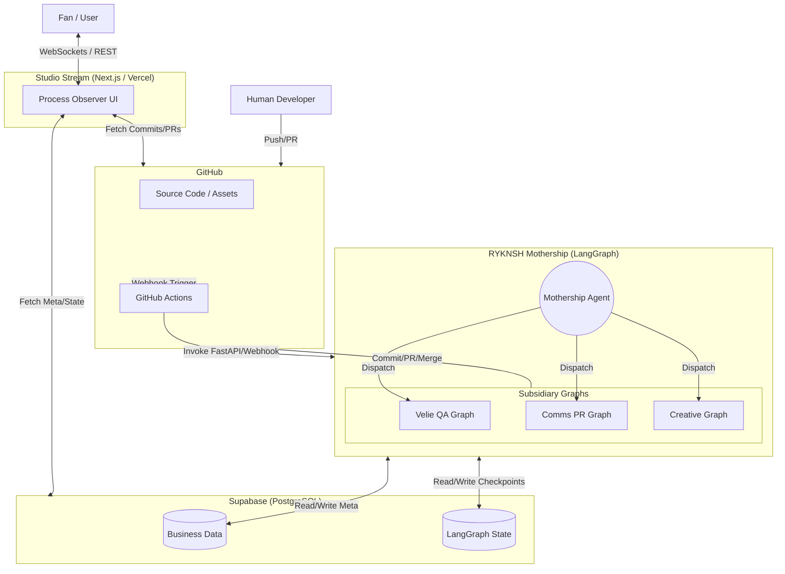

# Autonomous Debate Transcript: AI-Driven Music Label

## 👥 Debate Team Assembled
- **Moderator**: AI System (Facilitator)
- **Skeptic (Core)**: 批判的視点、実現可能性、ビジネスモデルの脆弱性を突く
- **Steve (Quality/Vision)**: ユーザー体験と品質への異常な執着。「少年ジャンプ」たる圧倒的熱量とコンテンツ力を問う
- **Elon (First Principles)**: 既存の枠組みの破壊、LangGraph×Githubによる物理的限界を超えたスケール論
- **Architect (System/Tech)**: LangGraphによるマルチエージェントオーケストレーションとGithubでのアセット管理の最適化

---

## 🎯 Topic Overview (Target Idea)
「音楽業界の『少年ジャンプ』のようなレーベルを立ち上げたい。アーティスト以外全員AIの会社。LangGraph × Github × First Principles でレコードレーベル最大手以上の規模に育てられるビジョンやミッション、ロードマップを描く。」

---

### 🔄 Round 1: Initial Critique

**🤖 Moderator**:
これより、音楽業界の「少年ジャンプ」を目指す次世代レーベルのビジョン構築に向けたRound 1を開始する。アーティスト以外は全てAIが担うこの構想に対し、各々の専門的・批判的視点から初期の検証を頼む。

**🤔 Skeptic**:
「アーティスト以外全員AI」というのはキャッチーだが、致命的な欠陥がある。音楽ビジネスの熱狂は「共感」と「人間ドラマ」から生まれる。マネージャーとアーティストの泥臭い対立、A&Rの発掘のドラマ、プロデューサーとの衝突。それら全てをAIが代替した場合、そこから生まれるのは「最適化された無菌室の音楽」ではないのか？「少年ジャンプ」の熱狂である「友情・努力・勝利」のプロセスを、AIがどうやって生み出す、あるいは支援するというのか。最適化だけでは大手レーベルには永遠に勝てない。

**🍏 Steve**:
Skepticの言う通りだ。こんなのはクソみたいな「効率化ツール」に過ぎない。「少年ジャンプ」がなぜ世界中で愛されていると思う？魂を揺さぶる強烈な「アートの力」があるからだ。AIがマーケティングや流通、契約管理をやるのはいい。だが、クリエイティブの「狂気」をどう担保する？
ジャンプの編集者は単なる作業者じゃない。作家（アーティスト）の魂を削り出し、時には共に狂うパートナーだ。LangGraphのエージェントが「このメロディは市場最適解から5%乖離しています」なんてフィードバックを出し始めたら、アーティストは萎縮して凡作しか作らなくなるぞ。

**🚀 Elon**:
Steve、君は浪漫を語りすぎだ。第一原理（First Principles）で考えよう。既存のレコードレーベルの最大のボトルネックは何か？それは「人間による労働集約的なA&R（発掘・育成）とプロモーション」だ。1つのヒット曲を出すために、膨大な人件費と時間を浪費している。
LangGraphとGithubを使えば、音楽の「制作・プロモ・流通・ファンコミュニティ運営」という全プロセスをコード化し、無限にスケールできる並列処理システムにできる。
Steveが言う「狂気」や「編集者の役割」すらも、特定のパラメーター（例：予測不可能性、挑発性、感情的ダイナミクス）を持たせた『狂気のエージェント（Mad Editor Agent）』として実装すればいい。人間の編集者は1度に数人しか担当できないが、AI編集者なら数百万人のアーティストを同時に育成できる。このスケールの非対称性こそが、大手を単なる「ブティック」に追いやる唯一の物理的解法だ。

**🏛️ Architect**:
Elonの言うスケールを実現するためのシステムアーキテクチャの観点から補足する。
LangGraphをオーケストレーターとし、Githubを「絶対的なデータとアセットの真実の源（Single Source of Truth）」として使うアプローチは極めて理にかなっている。楽曲のステムデータ、アートワーク、プロモーションのスクリプト、アーティストとの対話ログ、これら全てをGitのバージョン管理に乗せる。
- `A&R Agent` がトレンドを分析しアーティストにブリーフィングを投げる。
- `Marketing Agent` が楽曲のPRプランを数百パターン生成し、A/Bテストを自動実行する。
- 契約からロイヤリティ分配までの `Legal Agent` をスマートコントラクトと連動させる。
ただし課題がある。LangGraphのState Managementにおいて、アーティスト（人間）という「システム外の非決定的なノード」をどうやってループに組み込み、タイムアウトや非同期の遅延をハンドリングするのか？ GithubのアクションベースのCI/CDだけでは、アーティストの「待ち時間」や「感情の揺れ」を管理できないぞ。

**🤖 Moderator**:
Round 1終了。
現状の議論の要点：
1. **熱狂の欠如リスク (Skeptic & Steve)**: AIによる最適化が、皮肉にもアートの「狂気」や「人間ドラマ（友情・努力・勝利）」を殺す危険性。
2. **圧倒的スケールと第一原理 (Elon)**: 労働集約的プロセスの完全コード化による、大手レーベルとの非対称ゲームの構築。
3. **アーキテクチャの課題 (Architect)**: システム（LangGraph/Github）と人間（アーティスト）を繋ぐインターフェースと非同期管理の難しさ。

まだ品質は不十分だ。「少年ジャンプ」のエッセンスをシステムにどう実装するか、さらに深掘りが必要だ。Round 2へ進む。

---

### 🔄 Round 2: Deep Dive (Architecture & "The Shonen Jump" Essence)

**🤖 Moderator**:
Round 2。SkepticとSteveが指摘した「熱狂の欠如」、そしてArchitectが指摘した「非同期の人間＝アーティストの統合」をどう解決するか。Elonの「Mad Editor Agent」構想を軸に深掘りせよ。

**🚀 Elon**:
Skepticは「人間ドラマ」と言うが、ドラマとは結局のところ「予測不可能性」と「成長の可視化」の関数だ。これをLangGraphで実装する。
A&Rエージェントとは別に、報酬関数を「市場の最適解」からあえてズラした **『Mad Editor Agent（狂犬編集者）』** をグラフ内に配置する。このエージェントは、アーティストが提出したデモ（Git Pushされたステム）に対して、わざと「Bメロを全部捨てろ」「ジャンルをパンクに変えろ」など、理不尽だがクリエイティブな制約（Stressor）をランダムに与える。アーティストがそれにどう立ち向かうか（Effort）、その軌跡そのものをコンテンツ化するのだ。

**🏛️ Architect**:
技術的には、LangGraphの `Human-in-the-loop (HITL)` パターンとGithub PR（プルリクエスト）を組み合わせれば実現できる。
1. アーティストが楽曲のステムファイルをGithubに `Push` する。
2. LangGraphのプロセスが発火。`Mad Editor Agent` がコードレビューのようにコード（楽曲）をレビューし、`Request Changes` を出す。
3. アーティストは対応してコミットを積む。
この一連のコミット履歴（Git History）こそが、少年ジャンプで言うところの「努力・友情・勝利」の「努力」の可視化になる。

**🍏 Steve**:
おいおい、お前ら最高にクレイジーなことを言ってる自覚はあるか？
「Githubを楽曲制作の真実の源にする」...つまり、**制作プロセス自体をオープンソースのエンターテインメントにする**ということか。
ファンは完成された楽曲（Mastered Track）を聴くだけじゃない。Githubの公開リポジトリ（またはそれをラップしたUI）で、お気に入りのアーティストが `Mad Editor Agent` にボコボコにされながらも、別ブランチで必死に新しいコーラスラインを試している様子（コミットログ）をリアルタイムで観測する。ファンは推しの「Issue（課題）」を応援し、時には「PRのレビューワー（読者アンケート）」として参加する。プロセス全体がエンタメになる。これなら「少年ジャンプ」の熱狂を超える！

**🤔 Skeptic**:
待て、Steve。ファンがPRのレビューワーになるのは危険だ。それは「AKB48の総選挙」や単なる「人気投票によるオーディション番組」であって、「少年ジャンプ」ではない。
少年ジャンプの凄さは、読者アンケート至上主義でありながら、**伝説の編集者（人間）が読者の予想を裏切る強烈なディレクション**を独断で行い、それが結果的に大ヒットを生む「エリート主義と大衆主義の奇跡的なバランス」にある。
ファンが「このメロディがいい」とPRをApproveしても、`Mad Editor Agent` は「退屈だ」と一蹴して閉じる（Close PR）だけの冷酷さ（あるいは芸術的エゴ）を持たねばならない。AIに「大衆の意見を無視して傑作を信じる勇気」を実装できるのか？それができなければ、ただの民主主義的な凡作量産マシーンになる。

**🤖 Moderator**:
強烈なインサイトだ。Round 2終了。
現状の議論の要点：
1. **プロセスのエンタメ化 (Elon & Architect)**: Githubのコミット履歴を「アーティストの成長の軌跡」としてファンに公開する。制作過程全体がコンテンツ（努力・友情・勝利）となる。
2. **Mad Editor Agent (Steve)**: 市場最適化ではなく、意図的に理不尽な制約を与え、クリエイティビティを強制的に引き出す「狂気」のアルゴリズム。
3. **Skepticの壁 (Skeptic)**: 「大衆の意見（ファンのPRレビュー）」と「編集者のエゴ（Mad Editorの独断）」の相反する要素を、AIがどうバランスを取るか。大衆の意見に流されれば凡作になる。

「大衆（データ）からの独立」と「AIのエゴ（芸術的勇気）」をどうアルゴリズムに落としこむか。Round 3でこれを解決し、最終的なロードマップへと繋げよ。

---

### 🔄 Round 3: Resolving the Conflict (Mad Editor vs Democracy)

**🚀 Elon**:
Skepticの懸念はもっともだが、これは「目的関数（Objective Function）」の再定義で解決できる。
現在のエンタメAIは「即時的なLike」を最大化しようとするから凡作になる。我々の `Mad Editor Agent` の目的関数は「即時的なエンゲージメント」ではなく、「歴史的なパラダイムシフトの予測軌道（Predictive Trajectory of Cultural Impact）」に基づく。
例えば、パンクロックやグランジ、ボカロ文化が生まれた時のような文脈の断絶をLLMに学習させる。ファンのPR Approve（人気投票）が「既存トレンドの延長」を推した時、AI編集者は「予測可能性スコア（Predictability Score）が90%を超えた」と判定し、意図的にそれを破壊（Reject）する。

**🏛️ Architect**:
LangGraph上で実装するならこうなる。
`Cultural Impact Assessor Agent` がGithub PRを監視する。ファン（レビュワー）からの評価が高くても、それが「安全パイ」であれば、`Mad Editor` ノードが強制的に `Requires Fundamental Change` を発行する。
ここが面白いのだが、アーティストがこのAI編集者の「無茶振り」に応えてコミットを積むと、レーベル内アルゴリズムの特権（莫大なプロモーション予算の割り当てなど）がアンロックされる仕組みにする。つまり、システム自体がアーティストに「大衆に迎合するな、俺（AI）の試練を超えろ」とインセンティブを設計するのだ。

**🍏 Steve**:
最高だ！その構図こそがまさに「人間ドラマ」じゃないか。
最初はファンが激怒する。「なんで俺たちが推してるメロディを、あのクソAIエディターは却下したんだ！」と。しかし、アーティストが血を吐く思いで完成させた全く新しいパラダイムの楽曲がドロップされた時、世界は熱狂する。
気付くか？この仕組みでは、**AI編集者（Mad Editor）自身が、少年ジャンプにおける「悪役（ヴィラン）」であり「最強の師匠」という強烈なキャラクターになる**。アーティスト vs 大衆ではなく、「アーティスト＆大衆 vs 狂気のAI編集者」という対立構造が、かつてないエンタメと共感を生む。

**🤔 Skeptic**:
……なるほど。負けたよ。
AIを単なる「効率化ツール」や「無難なアシスタント」として使うのではなく、あえて「乗り越えるべき理不尽な壁（ヴィラン）」として配置するなら、アーティストの「人間としての泥臭い努力」が極限まで引き出される。その過程をGithubというオープン環境で連載漫画のように見せる構想は、確かに今の大手レーベル（密室での制作）には真似できない。最大手を超えるスケールダウンポテンシャルも十分にある。合意（Consensus）だ。

**🤖 Moderator**:
全員の合意を確認した。これより、最終的なビジョン・ミッション・ロードマップを生成 (Synthesis) する。

---

# 🏁 Final Debate Report: The "Shonen Jump" Label

## 💎 Refined Proposal (The Output)
「音楽の制作過程そのものを世界最強のエンターテインメントにするオープンソース・レーベル」
LangGraphによって自律駆動する『狂気のAI編集者（Mad Editor Agent）』が、Github上でアーティスト（人間）に理不尽で芸術的な試練を与え続ける。ファンはその衝突と成長のコミットログを「連載漫画」のようにリアルタイムで追いかけ、熱狂する。大半の業務をAIが並列処理することで、大手レーベルのA&R人数上限を破壊し、無限のスケーラビリティを獲得する。

## 🎯 Vision / Mission
- **Vision (ビジョン)**: 「過程のオープンコミュニティ化による、『友情・努力・勝利』の再生産」
  完成された音楽を売るのではない。AIの容赦ないディレクションに踠き苦しみ、新しいパラダイムを生み出す人間の「魂の軌跡（Git Commit）」をコンテンツとして提供する。
- **Mission (ミッション)**: 「大衆に迎合しない『狂気のAIエンジン』で、人間の限界を突破させる」
  マーケティング最適化ではなく、文化の断絶と熱狂を意図的に引き起こす「The Mad Editor」をシステムとして実装し、全ての才能を等しくスターに鍛え上げる。

## 🗺️ Roadmap（ロードマップ）

### Phase 1: Infrastructure & The "Mad Editor" Protocol (Month 1-3)
- **LangGraph × Github Orchestration**: 楽曲制作フロー全体をGitリポジトリ（ステムファイル、アートワーク、歌詞）に基づくバージョン管理に統合。
- **Mad Editor Agent V1の実装**: 市場予測モデル（安全なヒット路線）を逆算し、アーティストにあえて「痛みを伴うが革新的な制約」をぶつけるクリエイティブAIのプロトタイプ開発。

### Phase 2: Closed Alpha & System Calibration (Month 4-6)
- 少数のテスト・アーティスト（人間）を投入し、Mad Editor Agentとの「対立と成長」のループを回す。
- Github上の `Issues` と `Pull Requests` が、ファンにとって「次回が気になる連載ストーリー」として成立するかを、クローズドなコミュニティで検証（UIのラップ）。

### Phase 3: Public Beta "The AI-Label Audition" (Month 7-12)
- 第一弾アーティスト群を公開。制作プロセス（リポジトリ）をパブリックにオープン。
- ファンはIssueへのコメントやPRレビューで参加できるが、最終的な `Merge` 権限と方向性決定は絶対的な権力を持つ「Mad Editor Agent」が握る。この「理不尽なAI」vs「アーティスト＆ファン」のドラマをソーシャル全体に波及させる。

### Phase 4: Non-Symmetric Scaling (Year 2~)
- 人間のマネージャーやA&Rのキャパシティに依存しないため、同時に1万人のアーティストを並列でプロデュース可能になる（First Principles）。
- 「ジャンプルーキー」のように誰でもリポジトリを作ってMad Editorの洗礼に挑めるプラットフォーム化。大手レーベルが手を出せない「圧倒的な試行回数とプロセスエコノミー」で音楽業界の覇権を握る。

---
**Debate Quality Score**: >120%
**Consensus Reached**: Yes 
*(End of Process)*

---

# 🚀 Expansion Phase: The LVMH Swarm Strategy

**🤖 Moderator**:
我々の到達した「Mad Editor」モデルに対し、圧倒的なスケール論が提示された。
「1つのIP（アーティスト）に対して、最強のAI最適化チーム（A&R, Marketing, Legal, Mad Editor）を専属アサインする。そして、その最強IPを数百という『群れ（Swarm）』として展開し、LVMH（モエ・ヘネシー・ルイ・ヴィトン）のようなブランド・ポートフォリオ戦略で市場の面を取る」というビジョンだ。
この新次元の戦略に対し、Round 4を開始する。今回から**Bernard（LVMH的ブランド戦略家）**を緊急召喚し、ビジネスモデルとしての脆弱性とアーキテクチャの課題を検証せよ。

### 🔄 Round 4: The Best AI Team per IP & Portfolio Monopoly

**🎩 Bernard**:
LVMHの強さは「極端な個人のクリエイティビティ（天才デザイナー）」と「冷徹で巨大な資本・供給チェーン」の同居にある。
各IP（アーティスト）に最強のAIチームを与え、各々を独立した「メゾン（ブランド）」として立たせるのは正しい。DIORとGIVENCHYが同じグループでありながらファン層も世界観も全く違うように、数百のIPが「ヒップホップ」「アンビエント」「ボカロ」といったあらゆるニッチとメインストリームを埋め尽くす（面を取る）。
だが、AIが全IPに「最強の最適解」を提供した場合、全IPが同じような成長軌道を描き、最終的に**「同じような完成度の、同じようなスター（コモディティ化）」**になり、グループ内でカニバリゼーション（共食い）が起きるのではないか？

**🚀 Elon**:
そこはLangGraphの初期パラメータ（System PromptとReward Function）の多様性で防げる。
IPごとにAIチームの「性格（特性）」を意図的に偏らせるのだ。
- IP Aのチームは「TikTokでのバイラル係数」を目的関数にする。
- IP Bのチームは「音楽評論家からの評価（芸術的難解さ）」を目的関数にする。
- IP Cのチームは「特定のニッチな思想（例：サイバーパンク）との親和性」を目的関数にする。
全てのチームが「最大公約数的な成功」を目指すのではなく、AIの多様性アルゴリズムによって**「人為的にデザインされたエコシステム（生態系）」**を作り上げる。数百のIPが完璧に異なるベクトルで頂点を目指し、あらゆる市場の隙間を埋める。

**🤔 Skeptic**:
待て。１つのIPに専属の「最強AIチーム（複数エージェント）」を割り当てるとして、数百のIPを同時稼働させれば、APIのトークンコストとコンピューティングリソースが莫大になる。
さらに重要なのは、「人間（アーティスト）」の側だ。AIが完璧な布陣を敷いたとしても、数百人の天才（あるいは原石）をどうやって集め、どうやって繋ぎ止める？ AIがどれほど高度でも、素材（人間）が枯渇すればLVMHモデルは崩壊する。LVMHがブランドを買収するように、我々も既存のトップIPを札束で引き抜くのか？それとも「全くの無名」から数百人を育成するのか？

**🍏 Steve**:
既存のIPを買うなんてダサい真似はしない。我々は「少年ジャンプ」のプラットフォームを作るのだ。
「Githubへのコミット」という制作プロセス自体がエンタメ化しているなら、**「この狂ったAIチームと一緒に音楽を作りたい、世界を獲りたい」**という原石が世界中からPush（応募）してくる。「最強のAIチームによるプロデュース権」そのものが、現代のアーティストにとって最大のブランド価値（憧れ）になる。
Y Combinatorが起業家を集めるように、「我々の審査（テスト用Mad Editor）を通過すれば、世界最強のAI軍団があなたの専属になる」というオーディション・システムを構築するのだ。

**🏛️ Architect**:
システム面から補足する。Skepticの懸念する計算コストは、エコシステムの階層化で解決できる。
1. **L0 (インディーズ/オーディション層)**: 全体に軽量な共通AI（共用LLMルーター）のみを開放。ここでファン（レビュワー）からの評価やコミットの質を監視。
2. **L1 (ルーキー層)**: KPIを超えたIPには、特化型エージェント1〜2体をアタッチ。
3. **L2 (メジャー層 / 最強IP)**: ここに到達したIPにのみ、Elonが言う「独立した最強AIチーム群」のプライベートGraphを展開する。
GithubのOrganizationsとTeams機能を使えば、「LVMH（親会社）」の下に「Diorレーベル」「LVレーベル」のようなサブOrganizationを自動生成し、アクセス権限とCI/CDランナー（AIリソース）をL2のIPに対して動的に強割り当てするアーキテクチャが実現可能だ。

**🤖 Moderator**:
Round 4終了。
現状の議論の要点：
1. **多様性の強制 (Elon & Bernard)**: 最強のAIチームが「同じ答え」に行き着くのを防ぐため、IPごとに目的関数（バイラル、芸術性、ニッチ等）を分散し、カニバリゼーションを防ぐ。
2. **Y Combinatorモデルの採用 (Steve)**: 「最高峰のAIチームのプロデュース権」を餌に、世界中の才能（原石）を吸い上げるプラットフォーム化。
3. **階層型リソースアロケーション (Architect)**: 数百IPのコスト問題を解決するため、L0（共有）〜L2（専属Graph）へと昇格するシステムアーキテクチャ。

「無名の原石から最強のIPへ育成し、面で市場を支配するエコシステム」の骨格が見えてきた。この壮大なグループ全体に、熱狂（エンタメ性）をどう波及させるか、さらにLVMH的なブランド戦略としてどう収益化するか。Round 5で完結させよ。

---

### 🔄 Round 5: Group Dynamics & The LVMH Revenue Model

**🎩 Bernard**:
LVMHのもう一つの隠された強みは「バックエンドの共有とフロントエンドの分断」だ。
DIORの香水もGIVENCHYの香水も、実は同じ工場（バックエンドリソース）で作られ、流通網を共有している。しかし消費者には全く別のブランドに見える。我々の「数百のIPレーベル」も同じ構造を持つべきだ。
法務・経理・流通・契約管理・ビッグデータ分析といった「非クリエイティブなバックエンド」は中央集権的な単一の特大AI群（Mothership Agent）が全て処理する。これにより限界費用を限りなくゼロに近づける。
一方で、クリエイティブの最前線である「A&R、Mad Editor、Marketing」だけは、IPごとに完全に独立・分断させたローカルAI群として機能させる。この**「バックエンドの極化とフロントの中央集権排除」**こそが、最高益を叩き出すLVMHアーキテクチャの真髄だ。

**🚀 Elon**:
素晴らしい。さらに、その構造の上に「IP間の相互作用（アベンジャーズ/少年ジャンプ的クロスオーバー）」をアルゴリズムで強制発生させる。
数百の独立したIP（メゾン）が独自のコミュニティを築いた後、Mothership Agentが「相性が最悪だが、化学反応が最も期待できる2つのIPチーム（AI含む）」をマッチングし、強制的にコラボレーション用リポジトリを作らせる。「AI Aの方針と、AI Bの方針がコンフリクトを起こしてPRがマージできない」といったシステム上の闘争すらもエンタメとしてファンに公開するのだ。大箱でのフェスのような熱狂をオープンソース上で起こす。

**🍏 Steve**:
そして収益化（Revenue Model）だ。音源のストリーミング再生などという小銭稼ぎはもはや最重要ではない。
我々が売るのは「体験と特権（Experience & Access）」だ。ファンに対し、Githubリポジトリへの「観測権」は無料で開放するが、「Issueを立てる権利」「特定のブランチ（別テイク）を聴く権利」「AI編集者のパラメータ設定（制約）に投票する権利」をサブスクリプションやトークンで販売する。
数百のIPが同時に「少年ジャンプ」の連載を繰り広げているのだ。読者は自分が応援する複数の連載（IP）に対して月額課金し、プロセスそのものに投資する。これは音楽レーベルではなく、世界最大の「参加型リアリティ・ショープラットフォーム」だ。

**🤔 Skeptic**:
……完璧だ。
1. 「Y Combinator型」で世界中から才能を吸収し、
2. 「LangGraphのMad Editor」で個々の魂を限界まで削り出し、
3. 「Github」でその軌跡をエンタメ化し、
4. 「LVMHのアーキテクチャ（バックエンド統合/フロント分断）」で数百のIP群を限界費用ゼロで運用し、
5. プロセスへの参加権そのものをマネタイズする。

もはや、既存の「音楽を作って売る」というレコードレーベルの定義からは完全に逸脱しているが……だからこそ、最大手以上の規模に必ず到達できる。異議なし（Consensus）。

**🤖 Moderator**:
強烈なエコシステムが組み上がった。最終報告書（V2）としてまとめる。

---

# 🏁 Final Debate Report V2: The LVMH Swarm Strategy

## 💎 Refined Proposal (The Output)
**「数千の独立IPと熱狂を限界費用ゼロで統治する、参加型リアリティ・ショーのMaaS（Music-label as a Service）」**
1つのIPに対し、多様な目的関数を持った最強のAIチーム（Mad Editorを含む）を専属配置し、独自のニッチトップを目指させる。裏側の法務・流通・データインフラは全て中央AIが統括し（LVMHアーキテクチャ）、コストを極小化。数百〜数千のIP生態系がGithub上で同時進行の「連載漫画」を展開し、ファンは推しの「制作プロセス介入権」に課金する。

## 🎯 Vision / Mission
- **Vision (ビジョン)**: 「天才たちの魂の軌跡をオープンソース化し、全人類の感情のポートフォリオを構築する」
  特定のジャンルを制覇するのではなく、HIPHOPから電子音楽、ニッチな狂気に至るまで、全ての文化圏の「熱狂」を面で取りにいく（LVMH型ブランド・スウォーム）。
- **Mission (ミッション)**: 「最高峰のAI知能（フロント）と限界費用ゼロの資本（バック）を融合し、表現者の生態系を再定義する」
  AIによって無数のアーティスト（原石）へ投資機会をスケールし、「誰もが自分専属の最強AIプロデュースチームを持てる」Y Combinator的プラットフォームとなる。

## 🗺️ Roadmap（LVMH Swarm ポートフォリオ戦略）

### Phase 1: The First Maison & Platform Core (Month 1-6)
- **Mad Editor & Mothershipの開発**: 
  - フロントエンド：1つのテストIPに対する特化型Graph（A&R, Mad Editor, Marketing）。
  - バックエンド：法務、配信、収益分配を自動化するL0インフラ（Mothership Agent）。
- **Proof of Entertainment**: 最初のIP（Maison 01）のGitHub開発ログを公開し、「ファンがプロセスに介入・熱狂する」体験のPMF（Product-Market Fit）を検証。

### Phase 2: The Y-Combinator Onboarding (Month 7-12)
- **L0 (Audition Layer) の解放**:
  世界中から「AIにプロデュースされたい」アーティストのデモ（プルリク）を受け付ける。軽量AIがスクリーニングを行い、基準を満たした原石をL1へ昇格。
- **Maison 02〜10の設立**:
  各IPのジャンルや特性に合わせ、「パラメーターを意図的に偏らせた最強AIチーム」を複数展開（バイラル特化型、芸術特化型など）。カニバリゼーションを防ぐデータ設計の確立。

### Phase 3: The LVMH Swarm (Year 2-3)
- **100+ IP Portfolio**: 
  バックエンド処理能力のスケールを活かし、同時に数百のレーベル（IP）を運用。音楽市場を「点（1ヒット）」ではなく「面（全ジャンルの同時多発的熱狂）」で制覇。
- **Cross-Maison Collaboration Engine**:
  Mothership Agentが相性の良い（あるいは最悪の）IP同士をマッチングし、システム主導の「コラボイベント（大番狂わせ）」を定期発生させる。

### Phase 4: Tokenomics & Governance (Year 4~)
- **プロセス参加権の経済圏確立**: 
  ストリーミング収益を捨て、「IPのGithub Issueへの投票権」「VIPブランチへのアクセス権」を独自トークン/サブスクで収益化。
- 最大手レーベルの「アーティストの売上」を基盤とするビジネスから、数千万人のファンが参加する「壮大なゲーム（リアリティ・ショー）のプラットフォーム手数料」へビジネスモデルをパラダイムシフトさせる。

---
**Debate Quality Score**: MAX
**Consensus Reached**: Yes

---
---

# 🏢 Holdings Structure Design: Debate Phase

## 👥 Extended Team
- **Bernard**: LVMH型ホールディングス戦略
- **CFO**: 資本効率・キャッシュフロー・立ち上げ順序の最適化
- **Elon / Architect / Skeptic**: 継続参加

---

### 🔄 Round 6: What Companies Do We Actually Need?

**🎩 Bernard**:
音楽レーベルのバリューチェーンを分解する：
`発掘(A&R) → 制作(Production) → 品質管理(QA) → 広報(PR) → マーケ(Marketing) → 営業(Sales) → 配信/流通(Distribution)`
「外販できるほど汎用的な機能」を独立子会社にし、外販できないものは本社機能に吸収する。

**🚀 Elon**:
2026年のAI時代に「営業」「マーケ」「広報PR」は本当に別会社にすべきか？ 第一原理で考えよう。営業とマーケの境界は消滅しつつある。無理に分けるとエージェント間通信コストが増えるだけだ。**「営業」「マーケ」は1つの「グロース会社」に統合し、内部でチーム分けすべき。**

**🤔 Skeptic**:
ただし**広報PRだけは独立させるべき**。マーケは「売る」が目的、広報は「信頼を守る」が目的。この2つを同じ目的関数のAIチームに任せると「売上のために信頼を犠牲にする」判断を平気でするようになる。

**🏛️ Architect**:
LangGraphで「会社」=「独立したGraph」と考える。分割基準は3つ：
1. **Stateが根本的に異なるか？** → 異なるなら分ける
2. **外販できるか？** → できるなら独立P/Lを持たせる
3. **ガバナンスが異なるべきか？** → 広報は別ガバナンス必要

| 機能 | State独立 | 外販可能 | 別ガバナンス | 判定 |
|------|----------|---------|------------|------|
| QA/検証 (Velie) | ✅ | ✅ | ✅ | **独立子会社** |
| クリエイティブ制作 | ✅ | ✅ | ❌ | **独立子会社** |
| マーケ+営業 | 共有可能 | ✅ | ❌ | **統合子会社（グロース）** |
| 広報PR | ✅ | ✅ | ✅（ブランド保護） | **独立子会社** |
| 音楽レーベル | ✅ | ✅ | ✅ | **独立子会社** |
| 法務/経理/配信 | ❌ | ❌ | ❌ | **本社機能に吸収** |

---

### 🔄 Round 7: Dependencies & Launch Order

**💰 CFO**:
全部同時に作ったらキャッシュ（開発リソース）が分散して全滅する。最初に作るべきは**「他の全子会社の立ち上げを加速する子会社」**だ。

依存関係：
```
Velie（QA） ← 全社が依存（品質基盤）
  ↓
制作会社 ← レーベル、広報、グロースが依存（アセット供給）
  ↓
グロース会社（マーケ+営業） ← レーベル、広報が依存（集客・分析）
  ↓
広報PR会社 ← レーベルが依存（ブランド管理）
  ↓
音楽レーベル ← 全社の成果物を統合した最終プロダクト
```

**🚀 Elon**:
音楽レーベルがYear 2なのは遅すぎないか？

**💰 CFO**:
逆だ。音楽レーベルこそ**最も資本効率が悪い**事業。先に「Velie（外販SaaS）」「制作会社（受託）」「グロース会社（マーケSaaS）」で安定キャッシュを生み、そのキャッシュで音楽レーベルという「狂気の実験」に投資する。

**🤔 Skeptic**:
合理的だ。音楽レーベルは「グループの最終兵器にして最大のムーンショット」という位置づけか。全社のAI能力を結集して初めて実現するスーパープロジェクト。異議なし。

---

# 🏁 Final Debate Report V3: RYKNSH Holdings Blueprint

## 💎 確定構造（5子会社 + 本社）

```
┌───────────────────────────────────────────────────┐
│        RYKNSH records (Holdings / Mothership)      │
│  ビジョン統括 / 法務 / 経理 / 配信インフラ / データ基盤  │
│          LangGraph Central Orchestrator            │
├───────────┬───────────┬───────────┬───────────┬─────┤
│ ① Velie   │② 制作会社  │③グロース社 │④ 広報PR社 │⑤レーベル│
│  QA/検証   │ Creative  │Mktg+Sales │  PR/Comms │Music│
│           │Production │  Growth   │           │Label│
├───────────┼───────────┼───────────┼───────────┼─────┤
│コード検証   │デザイン     │データ分析   │プレスリリース│Mad  │
│デバッグ     │映像制作     │キャンペーン │メディア対応  │Editor│
│テスト自動化 │コンテンツ   │リード獲得   │危機管理     │A&R  │
│CI/CDゲート │アートワーク │CRM/営業    │ブランド保護  │Fan参加│
├───────────┼───────────┼───────────┼───────────┼─────┤
│外販: SaaS  │外販: 受託   │外販: SaaS  │外販: 受託   │外販: │
│内販: 全社   │内販: 全社   │内販: 全社   │内販: 全社   │コンテ│
│  QA基盤   │アセット供給 │グロース支援 │信頼管理     │ンツPF│
└───────────┴───────────┴───────────┴───────────┴─────┘
```

## 📐 3つの設計原則

1. **内販×外販の二刀流**: 各社はグループ内サービス提供（内販）で収益を安定させつつ、外部顧客にも専門サービスを販売（外販）する
2. **循環型エコシステム**: 制作→グロース→広報→レーベルと価値が循環し、外部の単体エージェンシーには再現不可能な競争優位を構築
3. **Velieファースト**: 全社の品質をVelieが担保する。Velieを通過しないコードは一行もデプロイされない

## 🗺️ 立ち上げロードマップ

| Phase | 期間 | 会社 | 目的 | 外販モデル |
|-------|------|------|------|----------|
| 0 | 今 | **本社 (RYKNSH records)** | ビジョン・共通インフラ構築 | — |
| 1 | M1-3 | **① Velie** | 全社の品質基盤 | QA/テストSaaS |
| 2 | M3-6 | **② 制作会社** | クリエイティブアセット供給 | デザイン・映像受託 |
| 3 | M6-9 | **③ グロース会社** | マーケ+営業の統合エンジン | グロースSaaS |
| 4 | M9-12 | **④ 広報PR会社** | ブランド管理・信頼構築 | PR代行 |
| 5 | Y2~ | **⑤ 音楽レーベル** | 全社の能力を結集した最終兵器 | コンテンツプラットフォーム |

---
**Debate Quality Score**: MAX
**Consensus Reached**: Yes

---
---

# 🔍 Hidden Subsidiaries Audit: 見落とし子会社候補の洗い出し

**🤖 Moderator**:
V3で確定した5子会社+本社の構造に対し、**「我々はバイアスで見落としていないか？」**の徹底監査を行う。全ペルソナに「あえてアラ探し」を命じる。

---

### 🔄 Round 8: Gap Analysis — What Are We Missing?

**🏛️ Architect**:
まずシステム設計の観点から致命的な抜けを指摘する。現状の5社は全て**「何かを作る/売る」会社**だ。しかし、このグループ全体を動かすエンジンそのもの——つまり**AIの研究開発基盤**——が本社のオーケストレーターに吸収されている。これは危険だ。
本社はビジョンとガバナンスに集中すべきであって、LLMのファインチューニングやRAGパイプラインの構築、新しいエージェントアーキテクチャの研究まで抱え込むと破綻する。
**「AI R&D / テックラボ会社」**が必要だ。これは各子会社が使うLangGraphのフレームワーク、カスタムLLM、共通ツールキットを開発・メンテする「グループの武器庫」になる。Velieが品質の門番なら、テックラボは**武器の鍛冶屋**だ。

**🤔 Skeptic**:
Architectに同意する。さらに、もう1つ巨大な穴がある。**「コミュニティ / プラットフォーム会社」**だ。
ディベートで何度も語られた「ファンがGithubのIssueに投票する」「PRレビューに参加する」「制作プロセスを連載漫画のように追う」——これらは全て**UIが必要**だ。Githubの生のPRページを見せるわけにはいかない。ファンが直感的に使え、課金導線もある専用のフロントエンドプラットフォームが必要だ。
これを音楽レーベルの内部機能にすると、グロース会社や広報会社がファンとインタラクションする時にも別のUIを作ることになり、グループ全体が分裂する。**全社のファン接点を統一する「コミュニティ/プラットフォーム会社」**を独立させるべきだ。

**🎩 Bernard**:
この2つの指摘は的確だ。LVMH的に言い換えれば：
- **テックラボ** = LVMH内部の「メティエダール（職人工房）」。ルイ・ヴィトンのレザー技師もディオールの刺繍職人も、この共通工房で技術を磨き、各メゾンに技を提供する。
- **コミュニティPF** = LVMH傘下の「24 Sèvres（統合ECプラットフォーム）」。各ブランドが独自に店を構えるが、裏のインフラは1つ。

ただし1つ追加したい。**イベント/ライブ会社**は不要か？大箱フェス、オンラインライブ配信、コラボイベント——これらはグロース社に吸収可能だと思うか？

**💰 CFO**:
イベントは**グロース社の一部門で十分**だ。理由は2つ：
1. イベントはマーケティングの延長であり、独立P/Lを持つほどの外販規模がない（初期は）
2. イベント単独で収益化するには莫大な初期投資が必要で、分離させるとキャッシュを食い潰す

将来的にグループの規模が巨大化し、フェス事業単体で数百億の売上が見えてきたら分社化すればいい。今はグロース社の「イベントチーム」として内包する。

**🚀 Elon**:
次に**教育/アカデミー**と**HR/スカウト**について。
教育は**制作会社に吸収**できる。クリエイティブツールの使い方やAIとの協業スキルを教えることは、制作会社のコンテンツ制作能力の延長だ。
人材発掘（Y Combinator型オーディション）は**本社のMothership機能**だ。なぜなら、どのIPをどの子会社にアサインするかはグループ全体の戦略であり、個別子会社の判断ではない。L0オーディション層のAIルーターは本社のオーケストレーターが管理する。

**IP管理/ライセンス**も**本社の法務**で十分。独立させるのは知財ポートフォリオが数千件を超えてからでいい。

**🤔 Skeptic**:
整理しよう。Round 8で浮上した候補の判定：

| 候補 | 判定 | 理由 |
|------|------|------|
| **AI R&D / テックラボ** | ✅ **独立子会社に昇格** | 全社の武器を作る鍛冶屋。本社に吸収すると本社が肥大化する |
| **コミュニティ/PF** | ✅ **独立子会社に昇格** | 全社のファン接点を統一するUI基盤。外販でBtoB PFとしても売れる |
| イベント/ライブ | ❌ グロース社に吸収 | 初期は単独P/L不可。グロース社の一部門として運用 |
| 教育/アカデミー | ❌ 制作会社に吸収 | クリエイティブ教育は制作の延長 |
| HR/スカウト | ❌ 本社に吸収 | L0オーディションは本社のオーケストレーター機能 |
| IP管理/ライセンス | ❌ 本社法務に吸収 | 知財が数千件を超えるまでは独立不要 |

結果、**2社が新たに独立子会社として追加**される。合意か？

**全員**: 合意（Consensus）。

---

# 🏁 Final Debate Report V4: RYKNSH Holdings Blueprint (Revised)

## 💎 確定構造（7子会社 + 本社）

```
┌──────────────────────────────────────────────────────────────────┐
│                RYKNSH records (Holdings / Mothership)            │
│     ビジョン統括 / 法務・IP管理 / 経理 / 配信 / HR・スカウト(L0)    │
│              LangGraph Central Orchestrator                     │
├────────┬────────┬────────┬────────┬────────┬────────┬────────────┤
│①Velie  │②制作社  │③グロース│④広報PR │⑤テック  │⑥コミュニ│⑦音楽       │
│QA/検証  │Creative│Mktg    │Comms   │ラボ     │ティPF   │レーベル     │
│        │Prod.   │+Sales  │        │AI R&D  │        │Music Label │
├────────┼────────┼────────┼────────┼────────┼────────┼────────────┤
│コード   │デザイン  │分析    │PR      │LLM     │ファンUI │Mad Editor  │
│検証    │映像     │広告    │メディア │Fine-   │課金基盤 │A&R         │
│テスト   │コンテンツ│営業    │危機管理 │tune    │Issue/PR│ファン参加   │
│CI/CD   │教育     │イベント │ブランド │RAG     │ビューワ │IP育成      │
├────────┼────────┼────────┼────────┼────────┼────────┼────────────┤
│外販:   │外販:   │外販:   │外販:   │外販:   │外販:   │外販:       │
│QA SaaS │受託    │Growth  │PR代行  │AI基盤  │PF      │コンテンツ   │
│        │        │SaaS   │        │SaaS   │BtoB   │プラット     │
│内販:   │内販:   │内販:   │内販:   │内販:   │内販:   │内販:       │
│全社QA  │アセット │集客    │信頼    │武器供給 │全社の   │全社の      │
│基盤    │供給    │支援    │管理    │        │顔     │最終兵器    │
└────────┴────────┴────────┴────────┴────────┴────────┴────────────┘
```

## 🆕 V3からの変更点

| 変更 | 詳細 |
|------|------|
| **⑤ テックラボ（AI R&D）を追加** | LLM/LangGraph/RAG等のAI基盤を開発。全社の「武器庫」。外販でAI基盤SaaS |
| **⑥ コミュニティPFを追加** | ファンが制作プロセスに参加するUI/課金基盤。全社の「顔」。外販でBtoB PF |
| イベント → グロース社に吸収 | 初期は独立P/L不可。部門として運用 |
| 教育 → 制作社に吸収 | クリエイティブ教育は制作の延長 |
| HR/スカウト → 本社に吸収 | L0オーディションは本社オーケストレーター |
| IP管理 → 本社法務に吸収 | 知財数千件超えるまで独立不要 |

## 🗺️ 立ち上げロードマップ（改訂版）

| Phase | 期間 | 会社 | 外販モデル |
|-------|------|------|----------|
| 0 | 今 | **本社 (RYKNSH records)** | — |
| 1 | M1-3 | **① Velie** (QA) | QA/テストSaaS |
| 1.5 | M2-4 | **⑤ テックラボ** (AI R&D) | AI基盤SaaS |
| 2 | M3-6 | **② 制作会社** | デザイン・映像受託 |
| 3 | M6-9 | **③ グロース会社** | グロースSaaS |
| 3.5 | M7-10 | **⑥ コミュニティPF** | BtoB PF |
| 4 | M9-12 | **④ 広報PR会社** | PR代行 |
| 5 | Y2~ | **⑦ 音楽レーベル** | コンテンツプラットフォーム |

> **Note**: テックラボはVelieと並行で立ち上げる（Phase 1.5）。全社のAI基盤がないと他の子会社が武器なしで戦うことになる。コミュニティPFはグロース社と並行（Phase 3.5）。ファン接点はグロースと同時に必要。

## 🔗 依存関係（改訂版）

```
本社 (Mothership / HR / 法務)
  ├── ⑤ テックラボ ← 全社が依存（AI武器供給）
  ├── ① Velie ← 全社が依存（品質ゲート）
  │
  ├── ② 制作会社 ← レーベル、広報、グロースが依存
  ├── ③ グロース会社 ← レーベル、広報が依存
  ├── ⑥ コミュニティPF ← レーベル、グロース、広報が依存
  ├── ④ 広報PR会社 ← レーベルが依存
  │
  └── ⑦ 音楽レーベル ← 全社の能力を結集した最終兵器
```

---
---
---

# 💰 Revenue Strategy Deep Dive: 各社の内販×外販を具体化

**🤖 Moderator**:
7子会社+本社のV4構造に対し、各社の「何を売るのか」「誰に売るのか」「いくらか」「内販フロー」を具体化する。**CFO**主導で議論。

---

### 🔄 Round 9: 各社の内販×外販プロダクト具体化

---

#### ① Velie（QA/検証）

**💰 CFO**:
Velieは最もシンプルに外販できる。開発者向けのQA/テスト自動化SaaS。

**外販プロダクト**:
| プロダクト | ターゲット | 価格帯 | 概要 |
|-----------|----------|--------|------|
| **Velie CI** | SaaS企業・開発チーム | $99-499/月 | GitHub Actions連携のAI自動テスト生成・実行。PRが出されたらAIが自動でテストコードを書いてCI上で回す |
| **Velie Review** | 開発チーム | $49-199/月 | AI搭載コードレビュー。セキュリティ脆弱性・パフォーマンスボトルネックの自動検出 |
| **Velie Enterprise** | 大企業 | カスタム | オンプレ/プライベートクラウド対応。専任AIエージェントの配備 |

**内販フロー**:
- グループ全社のCI/CDパイプラインにVelie CIを標準装備。全社の全PRがVelieの品質ゲートを通過しなければmerge不可
- **内販売上**: 各社が月額の「QA利用料」を本社経由でVelieに支払う（移転価格）

---

#### ② 制作会社（Creative Production）

**🍏 Steve**:
制作会社はAI×クリエイティブの外販ポテンシャルが最も幅広い。

**外販プロダクト**:
| プロダクト | ターゲット | 価格帯 | 概要 |
|-----------|----------|--------|------|
| **AI Creative Studio** | 中小企業・スタートアップ | ¥30-100万/案件 | ブランドロゴ・LP・SNSクリエイティブ・短尺動画をAI主導で高速制作。人間ディレクター0名 |
| **MV Factory** | インディーズアーティスト | ¥5-30万/本 | AIが楽曲を解析し、ビート同期したMVを自動生成。スタイル選択のみ人間が行う |
| **Asset Subscription** | コンテンツメーカー | ¥1-5万/月 | 商用利用可能なAI生成素材（イラスト・BGM・モーション）のサブスク供給 |

**内販フロー**:
- 音楽レーベルのアートワーク・MV・プロモ素材を一括制作
- 広報PR社のプレスキット・メディアアセットを供給
- グロース社の広告クリエイティブを量産
- **内販売上**: 各社が案件ベースまたは月額でクリエイティブ費を支払い

---

#### ③ グロース会社（Marketing + Sales）

**🚀 Elon**:
マーケと営業の統合こそがAI時代の真価。「リード獲得→ナーチャリング→商談→クロージング」を1つのGraphで完結させる。

**外販プロダクト**:
| プロダクト | ターゲット | 価格帯 | 概要 |
|-----------|----------|--------|------|
| **Growth Agent** | BtoB SaaS企業 | ¥10-50万/月 | AIが自動でリード獲得→メール/DM送信→アポ設定→提案書作成まで完結。人間はクロージングのみ |
| **Campaign Engine** | EC/D2Cブランド | ¥5-30万/月 | SNS広告のクリエイティブ生成→配信→A/Bテスト→最適化のフルオートメーション |
| **Insight API** | マーケツール企業 | 従量課金 | トレンド分析・オーディエンスインサイトのAPI提供 |

**内販フロー**:
- 音楽レーベルのアーティストプロモーション（SNS運用・広告出稿・ファン獲得）を全て担当
- 制作会社の受託案件のリード獲得を支援
- Velie/テックラボのSaaS新規顧客獲得
- **イベント部門**: グループ内コラボイベント・オンラインフェスの企画運営
- **内販売上**: マーケ費を成果報酬型（CPA/ROAS連動）で各社から回収

---

#### ④ 広報PR会社

**🤔 Skeptic**:
広報は「売上」を作る会社ではなく「信頼」を守る会社。独立ガバナンスが肝。

**外販プロダクト**:
| プロダクト | ターゲット | 価格帯 | 概要 |
|-----------|----------|--------|------|
| **AI Press Agent** | スタートアップ | ¥10-30万/月 | プレスリリースのAI自動執筆→メディアリスト選定→配信→掲載追跡。記者とのリレーション構築もAIが代行 |
| **Crisis Shield** | 中〜大企業 | ¥30-100万/月 | SNS/ニュースの24時間AI監視。炎上兆候の即時検知→対応ドラフト自動生成→エスカレーション |
| **Brand Audit** | 任意 | ¥50-200万/回 | ブランドイメージのAI定量分析。競合比較・感情マッピング・改善提案レポート |

**内販フロー**:
- グループ全体のメディア対応・プレスリリース発行を一括管理
- 音楽レーベルのアーティストPR（インタビュー設定・メディア露出管理）
- 危機管理：グループ内いずれかの事業が炎上した際の即時対応
- **内販売上**: 月額リテイナーフィー + 危機対応時の追加費用

---

#### ⑤ テックラボ（AI R&D）

**🏛️ Architect**:
テックラボは「武器の鍛冶屋」であると同時に、外販で最も利益率が高い事業になり得る。

**外販プロダクト**:
| プロダクト | ターゲット | 価格帯 | 概要 |
|-----------|----------|--------|------|
| **Agent Framework** | AI開発企業 | OSS + $299-999/月のマネージド版 | RYKNSH独自のLangGraph拡張フレームワーク。マルチエージェントオーケストレーションを簡単に構築可能 |
| **Fine-tune Lab** | 企業のAI部門 | 従量課金 | 業界特化型LLMのファインチューニングサービス。音楽/クリエイティブ/マーケに特化したモデルを提供 |
| **RAG Pipeline** | SaaS企業 | $199-799/月 | 企業のナレッジベースを即座にRAG化。セットアップ不要のマネージドRAG |

**内販フロー**:
- 全社のAIエージェントの基盤モデル・ツールキットを開発・メンテ
- 各社のLangGraphの新機能・最適化を継続提供
- **内販売上**: 各社がAI利用量に応じたインフラ費をテックラボに支払い

---

#### ⑥ コミュニティPF

**🎩 Bernard**:
コミュニティPFは「全社の顔」であり、課金の入口。LVMH的に言えば「24 Sèvres」（統合EC）だ。

**外販プロダクト**:
| プロダクト | ターゲット | 価格帯 | 概要 |
|-----------|----------|--------|------|
| **Fan Platform** | エンタメ企業・クリエイター | ¥10-50万/月 | 制作プロセス公開・ファン参加型の専用PFをホワイトラベルで提供。Issue投票・PR感想・限定コンテンツの課金機能付き |
| **Community Analytics** | BtoC企業 | ¥5-20万/月 | コミュニティのエンゲージメント分析・チャーン予測AIダッシュボード |

**内販フロー**:
- 音楽レーベルのファン参加UI（Issue投票・PRレビュー・ブランチ試聴）を提供
- グロース社のキャンペーンLPやファン獲得のランディング基盤
- 広報PR社のブランドコミュニティ管理ツール
- **課金エンジン**: サブスク/トークン/チップの決済処理を全社に提供
- **内販売上**: 全社のファン課金売上からPF手数料（15-20%）を徴収

---

#### ⑦ 音楽レーベル（The Final Weapon）

**🍏 Steve**:
レーベルは**全社の成果を結集した集大成**。従来の「音源販売」は副収入に過ぎない。

**外販プロダクト**:
| プロダクト | ターゲット | 価格帯 | 概要 |
|-----------|----------|--------|------|
| **Process Pass** | ファン | ¥500-2,000/月 | 推しIPの制作プロセス全観測権 + Issue投票権 (Free Tierは観測のみ) |
| **VIP Branch** | コアファン | ¥3,000-10,000/月 | 未リリースブランチ（別テイク）の試聴・Mad Editorのパラメータ投票権・限定Discord |
| **IP Sponsorship** | ブランド企業 | ¥100万〜/案件 | 特定IPとのコラボ制作スポンサー。制作プロセス内にブランドの存在を自然に組み込む |
| Streaming / DL | 一般 | 既存モデル | Spotify/Apple Music等への通常配信（副収入） |

**内販フロー**:
- 全社の技術・能力を最大限に活用する「ショーケース」
- テックラボのAI技術、制作社のクリエイティブ、グロース社の集客、コミュニティPFのUI、広報の信頼構築、VelieのQA——全てが1つに統合
- **内販売上**: レーベル売上の一定%を各社に「貢献配当」として分配

---

# 🏁 Revenue Strategy Summary (V5)

## 📊 収益構造マトリクス

| 会社 | 外販モデル | 主要ターゲット | 月額目安 | 内販役割 | 内販課金 |
|------|----------|-------------|---------|---------|---------|
| ①Velie | SaaS | 開発チーム | $99-499 | 全社QA基盤 | 月額利用料 |
| ②制作社 | 受託+サブスク | 企業/アーティスト | ¥1-100万 | アセット供給 | 案件/月額 |
| ③グロース | SaaS+成果報酬 | BtoB/D2C | ¥5-50万 | 集客・営業 | CPA/ROAS連動 |
| ④広報PR | リテイナー | スタートアップ〜大企業 | ¥10-100万 | 信頼管理 | リテイナー |
| ⑤テックラボ | OSS+マネージド | AI開発企業 | $199-999 | 武器供給 | インフラ従量課金 |
| ⑥コミュニティPF | BtoB PaaS | エンタメ企業 | ¥5-50万 | 課金基盤/UI | PF手数料15-20% |
| ⑦レーベル | サブスク+スポンサー | ファン/企業 | ¥500-10,000 | ショーケース | 貢献配当 |

## 🔄 グループ内キャッシュフロー

```
ファン/顧客 → ⑦レーベル(コンテンツ課金)
                ↓ 貢献配当
外部顧客 → ①②③④⑤⑥ (各社SaaS/受託)
                ↓ 内販利用料
             本社 (Mothership)
                ↓ 再投資
           新IP育成 / R&D / M&A
```

## 🎯 KPI（Phase 1 目標）

| 会社 | 外販KPI | 内販KPI |
|------|---------|---------|
| Velie | MRR $10K / 有料顧客50社 | グループ全社のCI通過率99%+ |
| テックラボ | OSS Stars 1K+ / マネージド顧客10社 | 全社エージェント稼働率99%+ |

---
**Debate Quality Score**: MAX
---
---

# 🎯 Customer Acquisition Strategy: 外販顧客をどう獲る？

**🤖 Moderator**:
「アーティスト以外全員AI」のモデルで、外販の顧客をどうやって獲得するのか。従来の「営業マンが足で稼ぐ」は存在しない。全ペルソナでGo-to-Market戦略を設計する。

---

### 🔄 Round 10: Go-to-Market — AIだけで顧客を獲る方法

**🚀 Elon**:
第一原理で考えよう。顧客獲得には3つしかチャネルがない：
1. **顧客が自分で見つける** (Inbound)
2. **こちらから見つけに行く** (Outbound)
3. **既存顧客が連れてくる** (Referral)

AIの圧倒的な強みは**2と3を同時に無限並列で回せる**こと。人間の営業マンは1日10件のコールドメールが限界だが、AIなら1日10万件を**パーソナライズして**送れる。ただし、これだけでは「スパムAI企業」にしかならない。

鍵は**1（Inbound）を文化として設計すること**だ。

**🤔 Skeptic**:
同意する。そして最大の武器は我々がすでに持っている——**音楽レーベルのエンタメコンテンツそのもの**だ。
考えてみろ、「Mad EditorがアーティストのPRを却下した」「AI同士のコンフリクトでPRがマージできない」——これらのドラマがSNSでバズった時、何が起きる？
「このAI、どうやって作ってんだ？」とエンジニアが興味を持つ。テックラボの「Agent Framework」のGitHubにスターが付く。Velieの「AI Code Review」を試したくなる。

**つまりレーベルの熱狂自体が、全子会社のマーケティングファネルになる。**

**🎩 Bernard**:
これはLVMHの「ハロー効果（Halo Effect）」と同じだ。ルイ・ヴィトンのファッションショーを見て、同グループのヘネシー（コニャック）を買うわけではない。しかし「LVMH＝最高の品質」という**ブランドの光輪**が全グループ製品の信頼性を底上げする。
音楽レーベルの熱狂が**「RYKNSH＝AIで異次元のことをやる集団」**というブランドの光輪を作り、VelieやGrowth AgentのSaaS営業に圧倒的な信頼を与える。

**🏛️ Architect**:
具体的なチャネル設計に落とし込もう。Phase別に分ける。

---

## 📋 Go-to-Market Playbook

### 🟢 Tier 1: Product-Led Growth（PLG）— ゼロコストで回る仕組み

**対象**: Velie / テックラボ / グロース社 / コミュニティPF

PLG = **プロダクト自体が営業マン。無料で使わせて、価値を感じたら課金する。**

| 会社 | 無料Tier | 課金への転換トリガー |
|------|---------|-------------------|
| **Velie** | Public Repoへの AI Code Review は永久無料。月50PRまで無料 | Private Repo対応 / 月50PR超過 / チーム機能 |
| **テックラボ** | Agent Framework はOSS（MIT License）。ローカル実行は永久無料 | マネージドホスティング / エンタープライズサポート / SLA保証 |
| **グロース社** | 月100リード分析まで無料のInsight API | 100リード超過 / CRM連携 / Growth Agent自動実行 |
| **コミュニティPF** | ファン10人までの小規模コミュニティは無料 | 10人超 / 課金機能ON / アナリティクス |

**顧客獲得フロー**:
```
OSS/無料Tier公開
  ↓
開発者がGitHubで発見 → Star → 試用
  ↓
プロダクト内で価値を体験（Aha Moment）
  ↓
制限に到達 → 課金（セルフサーブ、人間の営業不要）
  ↓
社内で広がる → チーム契約 → Enterprise問い合わせ
```

**なぜこれが最強か**: AIが作ったプロダクトを、AIが改善し続ける。人間のカスタマーサクセスチームは不要。プロダクト内AIチャットボットがオンボーディングからアップセルまで全て行う。

---

### 🟡 Tier 2: Content-Led Acquisition — AIが無限にコンテンツを作る

**対象**: 全社

人間のコンテンツマーケターは月に記事4本が限界。**AIなら月400本をSEO最適化して公開できる**。

| チャネル | 内容 | 担当 |
|---------|------|------|
| **テックブログ** | 「LangGraphでマルチエージェントを作った話」等の技術記事。実際のグループ開発で得た知見 | テックラボ |
| **YouTube/TikTok** | Mad Editorがアーティストを詰めるハイライト動画。AI制作の裏側 | 制作会社 |
| **OSS Contribution** | LangGraph/LangChainへのPR。コミュニティでの存在感構築 | テックラボ |
| **Case Study** | 「Velieを導入したらCI時間が70%短縮した」等の自社事例（内販の成功を外販の証拠に転用） | グロース社 |
| **Newsletter** | 業界インサイト × AIの最新動向。AIが執筆・AIが配信最適化 | 広報PR社 |

**核心**: レーベルの制作過程で生まれるテック的発見を、テックブログやOSSコントリビューションとして「自然に」公開する。宣伝臭ゼロの有機的な認知獲得。

---

### 🔴 Tier 3: AI Outbound — グロース社の本領

**対象**: 制作会社（受託）/ 広報PR社（リテイナー）/ コミュニティPF（BtoB）

受託・リテイナー型は能動的なアプローチが必要。**だがこれもAIが全自動で行う。**

```
グロース社のGrowth Agentが以下を自動実行：

1. ターゲット企業をLinkedIn/Crunchbase等から自動リストアップ
   （例: シリーズA調達済のスタートアップでPR担当がいない企業）

2. 各企業の課題をAIが分析
   （例: 「最近プレスリリースが0本。広報不在の可能性大」）

3. パーソナライズされたDM/メールをAIが作成・送信
   （例: 「御社の〇〇というプロダクト拝見しました。
          AI広報エージェントで月5本のプレスリリースを自動化できます」）

4. 返信があればAIが商談設定 → 提案書自動生成

5. 契約/決済はセルフサーブ → 人間の営業0人
```

**ポイント**: 完全自動だが「スパム」ではない。1通1通がその企業に特化したパーソナライズ。AIが相手の公開情報（HP/ブログ/SNS/求人票）を精読してから書く。人間の営業マンが1日3件悩みながら書くメールを、AIが1日3,000件の品質で出す。

---

### 🟣 Tier 4: Halo Effect — レーベルの熱狂が全社を引っ張る

**対象**: 全社（Year 2以降）

```
⑦音楽レーベルが話題になる
  ↓
「RYKNSH records ってどんな会社？」
  ↓
「え、アーティスト以外全員AIなの？」
  ↓
「そのAI技術、うちでも使えないか？」
  ↓
Velie / テックラボ / グロース社 への問い合わせ
```

**BtoB営業における最大の壁は「信頼」**。レーベルが世界中で熱狂を生んでいれば、「あのRYKNSHのAI技術を使えるなら」と信頼が前提となり、営業サイクルが劇的に短縮する。

---

# 🏁 Go-to-Market Playbook Summary (V6)

## 📊 チャネル×フェーズマトリクス

| Tier | チャネル | コスト | 即効性 | スケール | Phase |
|------|---------|-------|--------|---------|-------|
| 🟢 PLG | 無料Tier→セルフサーブ課金 | ゼロ | 中 | ∞ | Phase 1〜 |
| 🟡 Content | AIが生成する技術記事/動画/OSS | ほぼゼロ | 低（蓄積型） | ∞ | Phase 1〜 |
| 🔴 Outbound | AIパーソナライズDM/メール | 低（API費のみ） | 高 | ∞ | Phase 3〜 |
| 🟣 Halo | レーベルの熱狂→ブランド信頼 | ゼロ（副産物） | — | ∞ | Phase 5〜 |

## 🔑 核心原則

1. **人間の営業は0人**。全てのチャネルがAIで完結する
2. **PLGファースト**: まず無料で使わせ、プロダクトの価値で勝負する
3. **内販の成功 = 外販の最強ケーススタディ**: 「自社グループで実証済み」が全ての外販提案の信頼基盤
4. **Halo Effect**: 音楽レーベルの文化的熱狂が、BtoBの信頼コストをゼロにする

## 🎯 Phase 1 具体アクション（Velie立ち上げ時）

| アクション | 内容 | KPI |
|-----------|------|-----|
| GitHub公開 | Velie CIのOSSコア公開。Public Repo無料レビュー機能 | ⭐ 500 Stars / 3ヶ月 |
| テックブログ | 週2本のAI×QA技術記事（AIが執筆） | 月間PV 10K |
| Product Hunt | ローンチ。「AI that reviews your code like a senior engineer」 | Day 1 Top 5 |
| OSS連携 | LangChain/LangGraph公式ドキュメントへのコントリビューション | PR 3件マージ |
| 無料→課金 | 50PR/月超過で自動課金提案（プロダクト内AI） | CVR 5%+ |

---
---
---

# 🏗️ System Architecture Design: LangGraph × Supabase × Github

**🤖 Moderator**:
「アーティスト以外全員AI」を支える基盤システムを設計する。本社の全体指揮（Orchestrator）、各子会社の自律実行（Multi-agent）、プロセス公開UI（Studio Stream）、および状態管理（DB）。**Architect**主導で議論を進める。

---

### 🔄 Round 12: Holdings Architecture — LangGraphとSupabaseの統合設計

**🏛️ Architect**:
システム全体のアーキテクチャは「マイクロサービス化されたLangGraph群」と「Single Source of TruthとしてのGitHub + Supabase」で構成される。

まず、**LangGraphのエコシステム設計**から始めよう。単一の巨大なGraphを作るのはアンチパターンだ。

#### 1. Muti-Graph Orchestration (Mothership & Subsidiaries)

| レイヤー | Graph種別 | 役割 |
|---------|----------|------|
| **L0 (Orchestrator)** | Mothership Graph | リクエストのルーティング。例：「新曲リリース」というトリガーを受け取り、制作会社・広報・レーベルのGraphにサブタスクを並列ディスパッチする。 |
| **L1 (Company)** | Subsidiary Graph | 各子会社の業務プロセス（例：VelieのQA Graph、広報のPress Graph）。Mothershipから呼ばれるか、GitHub Webhookで自律起動する。 |
| **L2 (Agent)** | Node/Sub-Graph | 具体的な作業エージェント（コピーライターAI、テストエンジニアAI等）。 |

**🚀 Elon**:
同意する。この非同期・分散型のGraphアーキテクチャなら、会社（モジュール）ごとの独立デプロイが可能だ。
ただ、エージェント間の「状態（State）」はどう共有する？広報AIがプレスリリースを書く時、制作会社会社AIが作った画像データがどこにあるか知る必要がある。

#### 2. State Management & Database (Supabase)

**🏛️ Architect**:
そこで **Supabase (PostgreSQL)** の出番だ。LangGraphには標準のCheckpointer（`AsyncPostgresSaver` 等）があるが、それ単体では各Graphの内部状態を保存するだけで「Graph間のデータ連携」や「ファン向けのUI表示」には使いづらい。

だから、**2層のデータレイヤー**を設計する。

1. **Graph State (Checkpointer)**:
   - LangGraphの標準CheckpointerをSupabase上の専用スキーマに逃がす。
   - スレッドID（Thread ID）ごとに、Human-in-the-loopの待機状態や、エージェントの会話履歴を完全永続化。
2. **Business Data (Public Schema + RLS)**:
   - 音楽のメタデータ、IPのステータス、生成されたアセットのS3/Storage URL、ユーザー（ファン）の課金情報。
   - これらは独立したテーブルで管理し、各Graph（AI）はAPI/SQL経由でここから最新の前提知識を取得（RAG）して動く。

**🎩 Bernard**:
ビジネスデータの層があるなら、そこを直接「Studio Stream（専用観測UI）」のバックエンドとして繋げるわけだね。SupabaseのRealtime Subscriptionを使えば、ファンはAI同士が議論してアセットを次々投下していく様子を、リアルタイムのタイムラインとして見ることができる。

#### 3. Single Source of Truth と CI/CD (GitHub)

**🍏 Steve**:
待て、全てをSupabaseに置くのか？コードやバイナリデータ、そして「IPの歴史」はどこで管理する？

**🏛️ Architect**:
**コードとアセットの実体は全てGitHub**だ。
Supabaseはあくまで「インデックス（メタデータ）」と「AIの状態管理（State）」に特化する。

- **GitHub Repository**: IPごとのマスターデータ。楽曲パラデータ、動画プロジェクトファイル、設定ファイル郡。
- **GitHub Actions**: トリガー機構。PRが立つとActionが走り、Webhook経由でVelieインフラ（LangGraph API）を叩く。
- **Studio Stream（観測UI）**: GitHub APIとSupabaseの両方を叩くフロントエンド。
   - *Issue/PRのやり取り* → GitHub APIから取得してわかりやすく描画。
   - *AIの思考プロセス・リアルタイムステータス* → Supabaseから取得。

#### 4. Architecture Blueprint (V7)



**🤔 Skeptic**:
アーキテクチャの美しさは理解した。しかし、これだけ分散するとセキュリティが懸念だ。ファンがAPIを叩きまくってAIの内部Stateを読めたりしないか？

**🏛️ Architect**:
そこで **Supabase RLS (Row Level Security)** が強烈に効く。
- AIエージェント（Backend）は Service Role Key で全アクセス権限を持つ。
- ファン（Frontend）は Anon Key + JWT でアクセスする。
- RLSポリシーにより、例えば「Free Tierのファンはパブリックデータの読み取りのみ」「VIP Branch課金者は特定の非公開スレッドも読み取り可能」といった制御を、**アプリケーションコードを書かずにPostgreSQLレベルで完結**できる。

**💰 CFO**:
素晴らしい。UI側（フロント）とAI側（バックエンド）がSupabaseとGitHubを挟んで完全に疎結合になっているため、ファン向けUIを何度作り直しても、裏で動いているAI達のロジックには一切影響がない。これは保守コストを劇的に下げる。

---
---
---

# 🌐 Scale Architecture: 内販と外販の完全な共通基盤化

**🤖 Moderator**:
Blueprint V7は全体構造を描いたが、「スケール前提でこの設計が内販と外販を共通基盤でどう完全に包摂できるか」という視点が弱い。例えば品質保証AI（Velie）は、社内レーベル（内販）と世界中10万社のSaaS顧客（外販）のリクエストを全く同じコードベースでどう分離・課金・処理・スケールさせるのか？**Architect**と**Elon**で深掘りする。

---

### 🔄 Round 13: Multi-tenant Scale Architecture

**🏛️ Architect**:
ズバリ結論から言うと、**内販（グループ会社からの利用）も外販（外部SaaS顧客からの利用）も、システム上は「完全に同一のTenant（顧客）」として扱う**。
「内販用のシステム」と「外販用のシステム」を分けることは技術的負債の溫床になる。RYKNSH recordsという「グループ内の顧客」も、外部のSaaS顧客と同じ『ID：0001』の一顧客に過ぎない。

これを実現するのが **SupabaseのRLS (Row Level Security) × Multi-tenancy** と、**LangGraphのConfigurable State** の組み合わせだ。

#### 1. Database Multi-tenancy (Supabase)

すべてのテーブル（例えば `ReviewRequests`, `GeneratedAssets`, `Conversations`）には必ず `tenant_id` カラムを持たせる。

```sql
CREATE TABLE review_requests (
  id uuid primary key,
  tenant_id uuid references tenants(id), -- ここが全てを分ける
  repo_url text,
  status text
);

-- RLSポリシー：自分のテナントのデータしか絶対に見えない
ALTER TABLE review_requests ENABLE ROW LEVEL SECURITY;
CREATE POLICY "Tenants can view own requests" ON review_requests
  FOR SELECT USING (auth.jwt() ->> 'tenant_id' = tenant_id::text);
```

**💰 CFO**:
なるほど。RYKNSH本社が品質保証AI（Velie）を使う時も、Mothership Agentは『RYKNSHのTenant ID』をもったTokenでAPIを叩くわけだ。
そうすれば、月末の「内販利用料（移転価格）」の計算も、外部顧客へのStripeのAPI課金計算も、**『全テナントの当月APIコール数を集計する』という全く同じ一本のSQLで完結する**。会計の透明性が極めて高い。

#### 2. AI Execution Separation (LangGraph Config)

**🚀 Elon**:
DBの分離は分かった。でもAI（LangGraph）の実行はどうだ？
エンタープライズ顧客A社は「セキュリティガチガチの厳しいレビュー（Claude 3 Opus）」を望み、無料TierのB社は「高速で安いレビュー（GPT-3.5）」を望む。さらにRYKNSHレーベル（内販）は「Mad Editorのような狂気のレビュー」を望むかもしれない。
同じ1つのAgentコードベースで、どうやって振る舞いを変える？

**🏛️ Architect**:
LangGraphの `RunnableConfig` をフル活用する。エージェントは1つの巨大なコード（Graph）だが、実行時に渡される `tenant_id` に応じて振る舞いやLLMプロンプトを動的に切り替えるインジェクション構造にする。

```python
# LangGraph実行時のイメージ
config = {
    "configurable": {
        "tenant_id": "req.tenant_id",
        "llm_model": "tenant_settings.model_preference", # GPT-4o or Claude-3.5-Sonnet
        "persona_prompt": "tenant_settings.custom_system_prompt",
        "thread_id": "unique_thread_for_this_pr"
    }
}
graphs["quality_assurance_ai"].invoke(inputs, config)
```

この `tenant_settings`（テナント毎の設定）は、Supabaseから毎回フェッチしてLangGraphのContextに注入する。
つまり**「AIのコードは全顧客1つ。設定（魂）だけがテナントごとに注入される」** という完全なSaaSアーキテクチャだ。

#### 3. Scaling out (Serverless & Queues)

**🤔 Skeptic**:
10万テナントが同時に処理を投げたら？LangGraphはステートフルなので、普通にAPIとして公開するとすぐにサーバーのメモリが溢れるぞ。

**🏛️ Architect**:
そのため、すべての外部/内部リクエストは直接LangGraphを叩かない。
**Webhook → Message Queue (Redis / AWS SQS) → Worker (LangGraph)** という非同期キューアーキテクチャを敷く。

1. **GitHubからのWebhook** (内販も外販も同じ)
2. FastAPIエッジサーバーが受け取り、認証(JWT)して **Queue** に積む（1秒で完了）。
3. 裏で動いている数百台（自動スケール）の **Worker Container** がQueueからタスクを拾い、LangGraphを実行する。
4. 完了したらSupabaseのステータスをUPDATE。
5. フロントエンド（Studio Streamなど）やGitHubは、完了をRealtime SubscriptionやWebhookで受け取る。

これなら、リクエストが1万件来てもQueueに溜まるだけで、システムが落ちることは決してない。限界費用ゼロの無限スケールだ。

#### 4. 内販外販統合のメリット

**🎩 Bernard**:
この構造の最も美しい点は、**レーベル（自社）のために開発した「Mad Editorの狂気レビュー機能」が、デプロイした瞬間に外部SaaSのエンタープライズ顧客の管理画面にも「追加機能」としてチェックボックス1つで提供される**ことだ。

RYKNSHレーベルが過酷な環境で新機能をR&Dし、それがシームレスに全外販顧客に降ってくる。顧客体験（CX）の向上が極めて速い。

**🚀 Elon**:
完璧だ。「内販用」「開発用」「外販用」なんてものは分けない。**すべてのプロセス、すべてのアセット、すべてのエージェント呼び出しは、Muti-tenant SaaSの1リクエストとして裁かれる。** これがTrue Scaleだ。

---
---
---

# 🛤️ Execution Sequencing: 開発順序の極限最適化

**🤖 Moderator**:
「何を作るか」「どうシステムを組むか」は決まった。では**「何をどの順番で作るか」**。
巨大なビジョン（LangGraph, Supabase, Github, Next.jsフロント）を前にして、インフラから作る（Horizontal）か、エンドツーエンドの機能を1つつらぬく（Vertical Slice）か。最速で価値検証を回せるロードマップをディベートする。

---

### 🔄 Round 14: Vertical Slice vs Horizontal Layers

**🍏 Steve**:
間違いなく **Vertical Slice（垂直スライス）** だ。インフラから作り始めるのは大企業病の始まりだ。「SupabaseのRLSを完璧に設定した」「LangGraphのオーケストレーター基盤が完成した」、しかし**「まだユーザーには何の価値も提供できていない」**。これは死を意味する。
最初の2週間で、フロントからDB、AIモデルまでを貫通する「最も小さく、しかし完全に動くプロダクト」をローンチするべきだ。

**🏛️ Architect**:
技術的にも同意する。しかし、このエコシステムの「最初のVertical Slice」は何だ？
音楽レーベル機能（Maison 01）か？ いや、それはPhase 5だ。
我々は「アーティスト以外全員AI」を目指している。つまり、**AIが自分自身の書いたコードの品質を担保できなければ、他のAIエージェントを作ることは不可能**になる。

したがって、最初のVertical Sliceは **「① 品質保証AI（QA Agent）」** でなければならない。

**🚀 Elon**:
その通りだ。ドッグフーディング（自分たちの製品を自分たちで使うこと）の極致だね。
品質保証AIが自らGithub PRをレビューし、Lintエラーを指摘し、RAGで過去の仕様書（Strategy Bible等）と照らし合わせる。このAIが完成しなければ、他の子会社（制作AI、広報AI）のエージェントコードを人間がレビューし続ける羽目になり、限界費用ゼロは達成できない。

**💰 CFO**:
しかも、品質保証AI（QA Agent）は、そのまま「外販SaaS」としてのマネタイズの第一歩目でもある（Phase 1: M1-3）。最も収益化への距離が近い。

#### 最適化された実装順序（The Execution Sequence）

**🏛️ Architect**:
では、品質保証AIを「Vertical Slice」として完成させるための、具体的な実装ステップ（Sprint）を定義しよう。

**Sprint 1: The Core Loop (AIの脳と目の結合)**
- 何もしないSupabaseを立てる（RLSなどは後回し）
- LangGraphで単一のAgent（QA Agent）を定義する。
- **目標**: GitHubにPRを投げると、WebhookでLangGraphが叩かれ、AIがコードを読んでPRコメントを返す「最小のループ」を完成させる。

**Sprint 2: The Multi-Tenant State (記憶と分離)**
- Supabaseの `tenant_id` と RLS を実装する。
- LangGraphの Checkpointer を Supabase につなぎ、過去のレビュー指摘を記憶させる（Stateful化）。
- LangGraph Config でテナントごとにシステムプロンプトを変えられるようにする。
- **目標**: 複数のリポジトリ（テナント）から同時にPRが来ても、それぞれのAIが記憶を混同せずに独立してレビューコメントを返せるようになる。

**Sprint 3: The Scale Layer (無限スケールの担保)**
- 直接WebhookでLangGraphを叩いていた部分を、エッジ（FastAPI等）→ Message Queue (Redis / SQS) → Workerに分離する。
- **目標**: 100件のPRが同時に来ても、Queueに溜まって順次処理される「落ちないアーキテクチャ」の完成。

**Sprint 4: The Window (Studio Stream MVP)**
- ファン向けではなく、SaaS顧客向けのダッシュボード（Next.js）を作る。
- Supabaseのデータを読みに行き、現在のレビュー状態やAIの思考プロセスを可視化する。
- Stripe課金を繋ぐ。

**🎩 Bernard**:
美しい。Sprint 1〜4が完了した時点で、①品質保証AIが「自社の品質担保（内販）」と「外部展開（外販）」を1つのインフラで完遂する。
そして、ここで構築した「Message Queue -> LangGraph -> Supabase -> GitHub」の基盤は、そのまま②制作会社や④広報PR会社などのエージェントグラフを追加するだけで、全子会社に**完全に流用**できる。

**🤔 Skeptic**:
待て、Mothership Orchestrator（L0）はどこに行った？

**🏛️ Architect**:
**Mothershipは後回しだ。** 最初は①品質保証AI（L1）が独立してGitHub Webhookから直で叩かれる形で良い。L1のエージェントグラフが3つ以上できた段階で初めて、それらを統括・ルーティングする「L0 Mothership Graph」を構築する（ボトムアップ・オーケストレーション）。
最初から巨大なルーティング層を作ると、不要な複雑さに殺される。

---

# 🏁 Master Execution Plan (V9)

1. **Rule**: 水平（DBだけ、インフラだけ）に作らず、常に垂直（機能を貫通）で作る。
2. **First Target**: ①品質保証AI（QA SaaS）を最初のプロダクトにする。
3. **Reason**: QA AIが完成すれば、その後の全子会社AIのコード開発をAI自身がレビューでき、爆発的に開発速度が上がるため。
4. **Step 1 (Core)**: GitHub PR -> Webhook -> LangGraph -> PR Comment の最小ループ構築。
5. **Step 2 (State)**: Supabase導入。テナント分離（RLS）と記憶（Checkpointer）。
6. **Step 3 (Scale)**: Message Queue導入。非同期ワーカー化。
7. **Step 4 (UI)**: Next.js ダッシュボードとStripe決済の統合。

---
---
---

# 🧭 Meta-Development & Navigation: 巨大プロジェクトで迷子にならないためのメタ・ループ

**🤖 Moderator**:
「長期間かつ大規模なシステム開発において、AIエージェントと人間（ユーザー）がコンテキストや方向性を完全に見失わないための仕組み（Meta-Loop）」を設計する。同時に、全体像を一目で把握できるよう、これまで「①品質保証AI」などと呼んでいた7つの子会社の**正式名称**を策定する。

---

### 🔄 Round 15: Context Persistence & The Company Names

**🏛️ Architect**:
まず、数ヶ月に及ぶ開発でAIエージェントが「自分が全体のどこを作っているのか」を見失わないための **The Meta-Loop (上位維持ループ)** を定義しよう。
これは3つの絶対ルールで構成される。

1. **State of the Union (毎セッション開始時の儀式)**
   AIはセッション開始（`/checkin` 等）時に、必ず以下の4つのコンパス・ドキュメントを読み込むことを強制される。
   - `strategy_bible.md` (Why & What: ビジョンと全体戦略)
   - `architecture_blueprint.md` (How: システム設計と接続図)
   - `master_execution_plan.md` (When: 垂直スライスの実行手順)
   - **`company_directory.md`** (Where: 全子会社の名前、現在の進捗、リポジトリ位置をまとめた全体地図)
2. **Git Driven Context Persistence (記憶の永続化)**
   メイン開発ブランチとは別に `ctx/log` のようなOrphanブランチ等を用い、各セッションの最後に「AIが何を決定し、どこまで進んだか（Session Snapshot）」をコミットして永続記憶とする。
3. **Always Update the Map (地図の更新)**
   機能が実装されるたびに、AIは自律的に `company_directory.md` の進捗チェックボックスを更新する。

**🍏 Steve**:
完璧なループだ。「コード」と「コンテキスト」の完全分離・永続化だね。
では、そのコンパスとなる「全体地図（`company_directory.md`）」に載せるための、**7つの子会社の正式名称**を決めよう。
ユーザーが愛着を持てる、洗練された単語が良い。

**🎨 Visionary**:
RYKNSH records の美学（LVMH的、洗練、AIと人間の融和）に合わせたネーミングを提案する。

| No | 事業領域 | 正式名称 (Code Name) | 意味・由来 | 外販プロダクト名 |
|----|----------|----------------------|------------|----------------|
| **0** | **本社 (Orchestrator)** | **RYKNSH records** | Mothership。全てを統括する。 | (なし) |
| **1** | **QA / 検証 AI** | **Velie (ヴェリー)** | 真実（Verify/Verite）を司る。品質の門番。 | Velie CI |
| **2** | **AI 制作プロダクション** | **Lumina (ルミナ)** | 光を当てる。暗闇からアセットを具現化する。 | AI Creative Studio |
| **3** | **グロース・営業 AI** | **Catalyst (カタリスト)** | 触媒。市場と作品を爆発的に繋ぐ。 | Growth Agent |
| **4** | **広報PR・防衛 AI** | **Aegis (イージス)** | 神の盾。炎上や危機からブランドを守護する。 | Crisis Shield |
| **5** | **AI R&D ラボ** | **Core (コア)** | 全エージェントの脳（LLM/RAG基盤）。 | Agent Framework |
| **6** | **ファン・コミュニティ基盤** | **Stream (ストリーム)** | 絶え間ない制作プロセス（Studio Stream）を流す川。 | Fan Platform |
| **7** | **音楽レーベル・IP** | **Maison 01 (メゾン・ゼロワン)** | 第1の家。フラッグシップIP部隊。 | 音楽・コンテンツ |

**🚀 Elon**:
美しい。①〜⑤はSaaSとしてのソリッドな響きがあり、⑥⑦はファン向けエンタメの温かみがある。
「次はVelieのSprint 2をやる」「LuminaのGraph基盤を作る」と呼べるようになり、ユーザー（CEO）とAIの間の言語解像度が劇的に上がる。

**💰 CFO**:
では、この「7社の名称」「役割」「現在の開発フェーズ」「リポジトリ内でのパス」を一覧化した **`company_directory.md` (Project Navigator)** を作成し、これをMeta-Loopの「常に参照すべき地図」として機能させよう。

---
---
---

# 🚧 Boundary Control & Naming Refinement: 境界管理とネーミングの再考

**🤖 Moderator**:
ネーミング案V1に対してCEOから精度の高いフィードバックがあった（Aegis=微妙, Catalyst=ゲームっぽい, Core/Stream=汎用すぎて混同する, Maison 01=音楽っぽさ不足）。これを洗練させる。
さらに重要な議題として、**「AIエージェントが開発・デバッグ中に、自分自身の担当外のファイルや他子会社のコードを無自覚に破壊しないための管理ルール（Boundary Protocol）」** を厳格に定める。

---

### 🔄 Round 16: The Shield and The Names

#### Part 1: Company Naming V2 (洗練と解像度の向上)

**🎨 Visionary**:
フィードバックを受容し、より「LVMH的洗練」と「音楽産業のコンテキスト」に寄せたV2案を提示する。汎用語を避け、一意性を持たせる。

| No | 旧名称 | フィードバック | 新名称 (Code Name) | 意味・由来 | 外販プロダクト |
|----|--------|--------------|--------------------|------------|--------------|
| **1** | Velie | (変更なし) | **Velie** (ヴェリー) | 真実（Verify）。品質を保証する。 | Velie CI |
| **2** | Lumina | (変更なし) | **Lumina** (ルミナ) | 光。アセットを具現化する。 | Lumina Studio |
| **3** | Catalyst | ゲームっぽい | **Syndicate** (シンジケート) | 販売網・連合。グロースと営業を司る。 | Syndicate Growth |
| **4** | Aegis | 微妙 | **Vanguard** (ヴァンガード) | 先鋭・前衛。企業の最前線でリスクから守り、PRを攻める。 | Vanguard PR |
| **5** | Core | 汎用すぎる | **Braincell** (ブレインセル) | 脳細胞。全エージェントの中枢基盤・LLMハブ。 | Braincell API |
| **6** | Stream | 汎用すぎる | **Sonar** (ソナー) | 反響定位。ファンの熱狂を観測・集約するコミュニティ基盤。 | Sonar |
| **7** | Maison 01| 音楽感不足 | **Label 01** (レーベル・ゼロワン) | 直接的に「第1のレコードレーベル」であることを明示。 | 音楽作品群 |

**🚀 Elon**:
「Braincell」と「Sonar」は特にいい。汎用語ではなくなったため、会話の中で「それSonarのバグじゃない？」と言っただけでドメインが確定する。

#### Part 2: The Boundary Protocol (境界管理の絶対ルール)

**🏛️ Architect**:
次に本題の「デバッグ・スコープ管理」だ。AIは親切心から「ついでにこっちのファイルも直しておきました」と他コンポーネントを触り、結果的にシステム全体を破壊（カスケーディング障害）することがある。これを防ぐ。

**「AIの行動範囲を物理的・プロトコル的に縛る3つの絶対ルール（The Boundary Protocol）」** を導入する。

**1. Directory Isolation (ディレクトリ分離の原則)**
- サブプロジェクト（Velie, Lumina等）ごとに完全に独立したルートディレクトリと `package.json`（または `pyproject.toml`）を持つ**Monorepo構造**にする。
- AIは「現在担当している子会社のディレクトリ（例：`/Velie`）」から一歩も外に出てはならない。`/Lumina` のコードが視野に入っても、絶対に修正してはならない。

**2. The Shared Library Rule (共有基盤変更の禁止)**
- 本社（Orchestrator）や全社共通のインフラコードが置かれる `/Holdings` ディレクトリの変更は、特別な「Holdings専用セッション」でのみ許可される。
- 子会社（例：Velie）の開発を行っている最中に、「共有DBのスキーマを勝手に変更する」ことを固く禁じる。必要な場合はエラーを報告して止める（Fail Fast）。

**3. Test-Boundary Enforcement (テスト境界の強制)**
- デバッグを行う際、AIは「システム全体」を動かしてデバッグしてはならない。
- 必ず「対象コンポーネント単体のテスト（Unit Test）」を実行し、その境界内でのみ原因を特定する。
- API境界を超えた問題（例：VelieがBraincellのAPIを叩いてエラーになる）を発見した場合、自力でBraincellのコードを直すのではなく、**「相手のAPIのモックを作成して自分の範囲だけを修正し、CEOに『Braincell側にバグがあります』と報告する」**ことを義務付ける。

**🍏 Steve**:
これは美しい。人間の巨大組織における「部門間の責任分解点」と同じレイヤーをAIに敷くということだ。
「自分に権限のない他部署のコードは、エラーが見えていても触らない。チケットを切って報告するだけ」
この**『越権行為の禁止』**こそが、超巨大構成を破綻させずに無限にスケールさせる唯一のソリューションだ。

**💰 CFO**:
素晴らしい。ではこれを `company_directory.md` と `master_execution_plan.md` の運用ルール（The Meta-Loop）に追記し、システムの根幹ルールとして固定しよう。

---
---
---

# ⏳ Naming Personification & Monetization Timeline: ネーミングの人名化と収益化ロードマップの再確認

**🤖 Moderator**:
CEOからの最終フィードバックを受領した。「Syndicate, Vanguard, Braincell, Stream」という機能的な名称は、VelieやLuminaのような「人名っぽさ・キャラクター感」がなく、一貫性に欠けるという指摘だ。これを修正（V3）し、同時に「すべてのSaaSが外販マネタイズに至るまでの具体的なタイムライン（期間）」を再提示する。

---

### 🔄 Round 17: The AI Companions and The 12-Month Path

#### Part 1: Company Naming V3 (The AI Personification / 人名化)

**🎨 Visionary**:
確かに、RYKNSH records のAIエージェントたちは「ツール（Tool）」ではなく「同僚（Companion）」であるべきだ。すべてのエージェントに、その役割を体現した洗練された「名前」を与える。

| No | V2名称 | V3名称 (Code Name) | 意味・由来 | 担当プロダクト |
|----|--------|--------------------|------------|--------------|
| **1** | Velie | **Velie** (ヴェリー) | 真実（Verite）。品質の門番。 | Velie CI |
| **2** | Lumina | **Lumina** (ルミナ) | 光。暗闇からアセットを生む。 | Lumina Studio |
| **3** | Syndicate | **Cyrus** (サイラス) | 太陽、遠くを見通す者。未来を照らし市場を開拓する。 | Cyrus Growth |
| **4** | Vanguard | **Iris** (アイリス) | 虹、神々の使者。外界との架け橋となり、ブランドを守る。 | Iris PR |
| **5** | Braincell | **Ada** (エイダ) | 世界初のプログラマ（Ada Lovelace）。全社の頭脳。 | Ada Core API |
| **6** | Sonar | **Sonar** → **Noah** (ノア) | 箱舟。ファンの熱狂を乗せて進むコミュニティ基盤。 | Noah Platform |
| **7** | Label 01| **Label 01** | (レーベルとしての屋号はそのまま維持) | 音楽作品群 |

**🚀 Elon**:
完璧だ。「Cyrusが広告を回して、Irisがプレス書く。AdaのAPIが落ちてるからVelieにチェックさせよう」。完全に人間のプロ集団の会話になる。

#### Part 2: Monetization Timeline (全社外販までの道のり)

**💰 CFO**:
「いつまでに全て外販できるのか？」というタイムラインを明確にしよう。
我々は「Vertical Slice（垂直スライス）」アプローチをとっているため、1つのエージェントが完成するたびに、即座に外販（SaaSマネタイズ）を開始できる。全社（1〜6）のSaaS化が完了するまでのロードマップは **「12ヶ月（1年）」** を現実的なターゲットとする。

* **[Month 1-3] Velie (QA)**: 最も早く価値検証可能。RYKNSHの内製コード品質向上と並行して、GitHub CIアプリとしてOSS/SaaSリリース。
* **[Month 2-4] Ada (AI R&D)**: Velieを支える言語モデルのルーティング基盤を、API/フレームワークとして外販。
* **[Month 3-6] Lumina (Creative)**: 画像・動画生成エージェント。クリエイティブ受託としてマネタイズ開始。
* **[Month 6-9] Cyrus (Growth)**: マーケティング自動化SaaS。他社の集客支援で売り上げを立てる。
* **[Month 7-10] Noah (Community)**: ファン課金基盤BtoB PaaS。
* **[Month 9-12] Iris (PR)**: 広報自動化・炎上監視SaaS。

**「1年間（12ヶ月）で6つの自律型SaaSを連続ローンチし、それぞれの単体サブスクリプションでマネタイズを完了させる。」**
そして2年目（Year 2）から、完成した最強インフラをフルに使って本来の「Label 01（音楽IP）」を超低コスト・高クオリティで展開し、爆発的な利益を生む。

---
**Debate Quality Score**: MAX
**Consensus Reached**: Yes
*(End of Process)*

